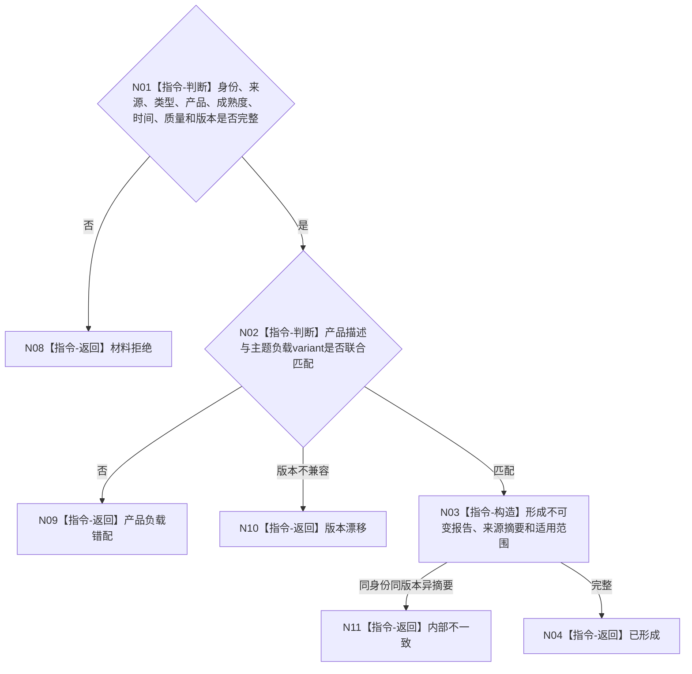

# BIZ-L3-006-03-04 构造强类型外设报告目标函数流程图 v0.1

更新时间：2026-08-03

## 依据

```text
6340、6350；BIZ-L2-006-03
```

## 身份与边界

正式目标函数设计图。纯值构造报告身份、来源、类型、产品、成熟度、时间、质量和适用范围；报告不是事实主体。

## 函数合同

```text
根函数：构造强类型外设报告
归属模块 / 文件 / 层级：外设报告协议 / 海中鱼巣/适配/协议.外设报告.ixx / L3
现有或待新增：待新增通用形成器；主题负载variant由主题协议拥有
完整签名：强类型外设报告构造结果 构造强类型外设报告(const 强类型外设报告构造请求& 请求) noexcept
参数：请求为只读借用；含报告身份、来源材料、外设/命令、报告/产品类型、成熟度、时间、TTL、质量、适用范围、主题负载和协议版本
返回结果：值式结果；含已形成、材料拒绝、产品负载错配、版本漂移或内部不一致，以及不可变强类型外设报告
被调函数流程图：无；字段和产品负载联合复核均为本函数内指令
父图：BIZ-L2-006-03
```

## 流程图



## 节点合同

| 节点 | 类型 | 参数 / 输入绑定 | 结果 / 输出绑定 | 事实读写 | 后继条件 | 验证 |
| --- | --- | --- | --- | --- | --- | --- |
| N01/N02 | 指令 | 报告字段和负载 | 构造资格 | 无写入 | 匹配或拒绝 | 产品/成熟度独立、variant |
| N03/N04 | 指令 | 合法材料 | 不可变报告 | 只形成材料 | 完成 | 来源摘要、同身份一致性 |

## 关键边界

报告不得确认存在、关系、状态、任务结果或因果；这些只能由后续任务承接和领域服务裁决。
