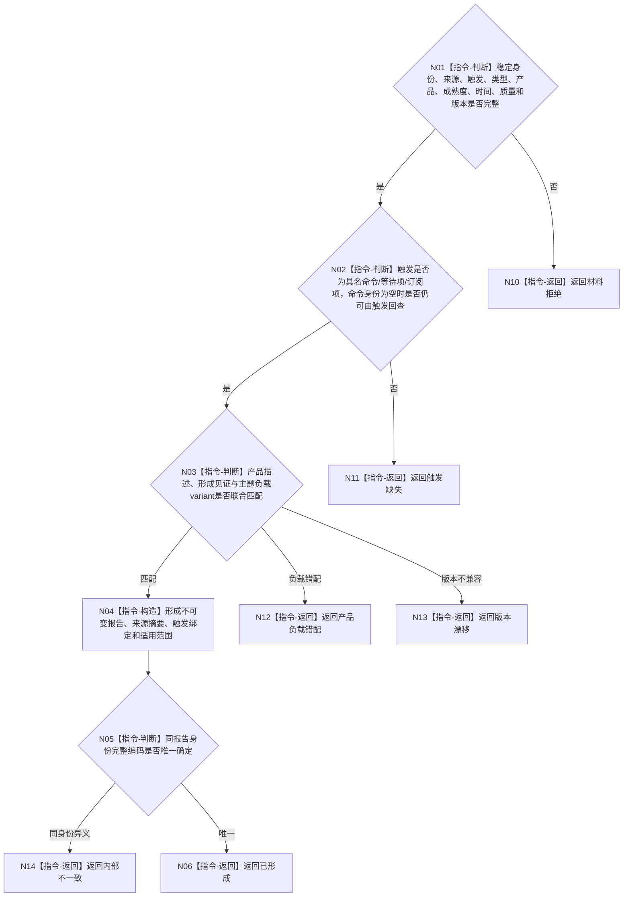

# BIZ-L3-006-03-04 构造强类型外设报告目标函数流程图 v0.2

更新时间：2026-08-27

## 依据

```text
6340 v0.6、6350 v0.6、6360；BIZ-L2-006-03 v0.2
```

## 身份与边界

正式目标函数设计图。纯值构造报告身份、来源、触发、类型、产品、成熟度、时间、质量、适用范围和主题负载。报告命令身份可以为空，但采集触发必须是具名命令、等待项或订阅项之一；禁止无触发自由采集。报告不是世界事实主体。

## 函数合同

```text
根函数：构造强类型外设报告
归属模块 / 文件 / 目标分解深度：外设报告协议 / 海中鱼巣/适配/协议.外设报告.ixx / BIZ-L3
现有或待新增：待新增通用形成器；主题负载variant由主题协议拥有
完整签名：强类型外设报告构造结果 构造强类型外设报告(const 强类型外设报告构造请求& 请求) noexcept
参数：请求为只读借用；含报告稳定身份、来源材料、来源外设、采集触发、可选命令身份、报告/产品类型、成熟度、时间、TTL、质量、适用范围、主题负载和协议版本
返回结果：值式结果；含已形成、材料拒绝、产品负载错配、版本漂移或内部不一致，以及不可变强类型外设报告
被调函数流程图：无；字段和产品负载联合复核均为本函数内指令
父图：BIZ-L2-006-03 v0.2
```

## 流程图



## 稳定身份合同

- 报告稳定身份是跨任务、窗口、生产代次和恢复代次的唯一竞争键；这些上下文只能进入报告内容或见证，不能与报告身份组成更宽松的复合唯一键。
- 同一稳定身份完整编码逐字段相同才是精确重复；任一来源、触发、产品、负载、时间、质量或适用范围不同均为内部不一致，不得重新签发新身份绕过冲突。

## 关键边界

报告不得确认存在、关系、状态、任务结果或因果；这些只能由后续6340任务域承接和领域服务裁决。
