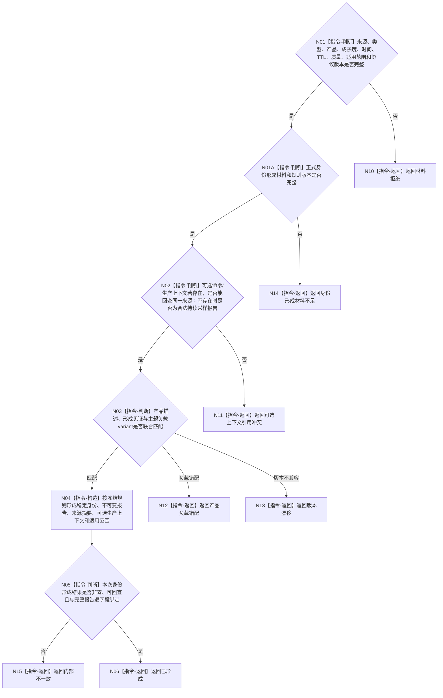

# BIZ-L3-006-03-04 构造强类型外设报告目标函数流程图 v0.2

更新时间：2026-08-28

## 依据

```text
6340 v0.6、6350 v0.6、6360；BIZ-L2-006-03 v0.2
```

## 身份与边界

正式目标职责图。纯值构造报告身份、来源、类型、产品、成熟度、时间、质量、适用范围和主题负载。持续采样报告可以没有命令、等待项或订阅项；真实存在的可选命令/生产上下文只作来源材料，不成为每份报告必填触发。报告不是世界事实主体。

## 函数合同

```text
根函数：构造强类型外设报告
归属模块 / 文件 / 目标分解深度：外设报告协议 / 具体模块与文件待详细设计 / BIZ-L3
现有或待新增：待新增通用形成职责；主题负载variant由6350所指PER-C1主题协议拥有；ABI未冻结
候选签名：强类型外设报告构造结果 构造强类型外设报告(const 强类型外设报告构造请求& 请求) noexcept
参数最低职责：同一来源材料/外设、报告/产品类型、成熟度、发生时间、TTL、质量、适用范围、主题负载、协议版本，以及正式身份形成材料与规则版本；可选命令/生产上下文只在真实存在时原样保留
返回结果：值式结果；含已形成、材料拒绝、身份材料不足、产品负载错配、版本漂移或内部不一致，以及带稳定身份的不可变强类型外设报告
被调函数流程图：无；字段和产品负载联合复核均为本函数内指令
父图：BIZ-L2-006-03 v0.2
```

## 流程图



## 稳定身份合同

- 报告稳定身份是跨任务、窗口、生产代次和恢复代次的唯一竞争键；这些上下文只能进入报告内容或见证，不能与报告身份组成更宽松的复合唯一键。
- 本纯值构造器只按后继详细设计冻结的身份规则形成或核对一次身份绑定，不拥有身份账，也不能证明“全局从未出现同身份异义”。同一身份完整内容的精确重复/异义冲突只由006-04恢复owner与物理队列发布边界按正式账判定。
- 报告身份生成规则仍须由后继详细设计冻结，不能从内容摘要、当前时间、队列位置或生产代次临场推导；规则或形成材料缺失时返回材料不足。

## 关键边界

报告不得确认存在、关系、状态、任务结果或因果；这些只能由后续6340任务域承接和领域服务裁决。
