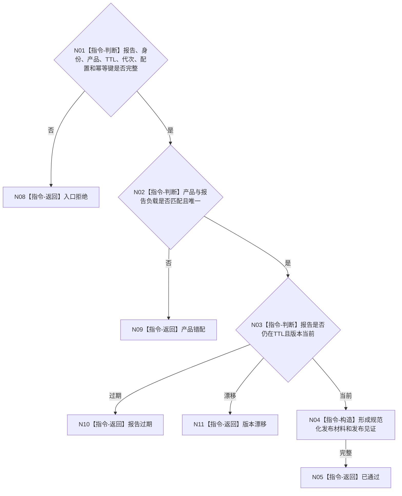

# BIZ-L3-006-04-01 复核外设报告发布合同目标函数流程图 v0.1

更新时间：2026-08-03

## 依据

```text
6340、6350；BIZ-L2-006-04
```

## 身份与边界

正式目标函数设计图。纯值复核报告来源、产品唯一性、TTL、代次、幂等键和恢复要求；不发布队列项。

## 函数合同

```text
根函数：复核外设报告发布合同
归属模块 / 文件 / 层级：外设报告发布协议 / 海中鱼巣/线程/协议.外设报告发布.ixx / L3
现有或待新增：待新增纯值函数
完整签名：外设报告发布合同复核结果 复核外设报告发布合同(const 外设报告发布合同复核请求& 请求) noexcept
参数：请求为只读借用；含不可变报告、报告身份、产品类型、TTL、生产代次、配置版本、幂等键和当前时间
返回结果：值式结果；含已通过、报告过期、产品错配、版本漂移、入口拒绝或内部不一致，以及规范化发布材料和发布见证
被调函数流程图：无；字段、TTL和产品联合复核均为本函数内指令
父图：BIZ-L2-006-04
```

## 流程图



## 节点合同

| 节点 | 类型 | 参数 / 输入绑定 | 结果 / 输出绑定 | 事实读写 | 后继条件 | 验证 |
| --- | --- | --- | --- | --- | --- | --- |
| N01—N03 | 指令 | 发布请求 | 发布资格 | 无写入 | 通过或具名拒绝 | 产品互斥、TTL、代次 |
| N04/N05 | 指令 | 合法报告 | 规范化材料和见证 | 无写入 | 完成 | 重试保持同报告身份 |

## 关键边界

发布资格不等于报告已进入队列，更不等于任务域已承接。

