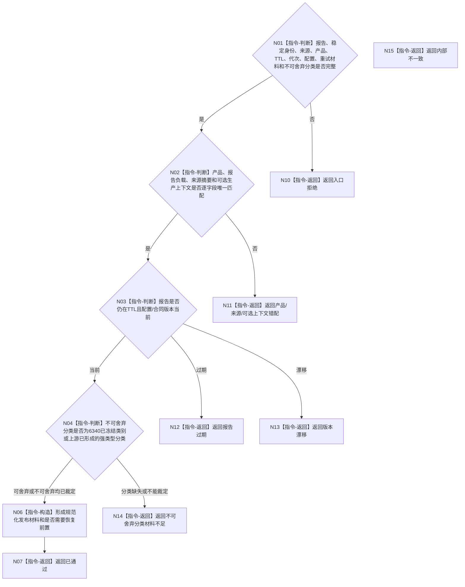

# BIZ-L3-006-04-01 复核外设报告发布合同目标函数流程图 v0.2

更新时间：2026-08-27

## 依据

```text
6340 v0.6、6350 v0.6、6360；BIZ-L2-006-04 v0.2
```

## 身份与边界

正式目标职责图。纯值复核报告来源、稳定身份、产品唯一性、TTL、生产代次、同身份重试材料及正式不可舍弃分类；输出规范化报告和是否需要恢复前置。不保存恢复材料、不发布队列项。无效、过期或产品错配报告在本步骤返回，不能先进入持久边界。

## 函数合同

```text
根目标：复核外设报告发布合同
归属模块 / 文件 / 目标分解深度：外设报告发布纯值协议边界 / 具体文件待详细设计 / BIZ-L3
现有或待新增：待新增；职责已冻结，ABI未冻结
候选签名：外设报告发布合同复核结果 复核外设报告发布合同(const 外设报告发布合同复核请求& 请求) noexcept
参数最低职责：006-03同一不可变报告、稳定身份、来源材料、产品、TTL、生产代次、配置版本、同身份重试材料、同基准当前时间及正式不可舍弃分类；真实存在的可选命令/生产上下文原样互证，不作为持续采样报告必填触发
返回结果最低分类：已通过、报告过期、产品错配、版本漂移、入口拒绝或内部不一致；成功携带规范化发布材料和是否需要恢复前置
被调函数流程图：无；字段、TTL、产品和恢复前置均为本函数内指令
父图：BIZ-L2-006-04 v0.2
```

## 流程图



## 关键边界

发布合同通过只证明报告可进入后继分流；不等于恢复前置已闭合、不等于报告已进入物理队列，更不等于任务域已经正式承接。实例级外设错误若缺6340/6350规定的报告作用范围或产品承载，必须返回分类材料不足，不能在本函数临场补造。
