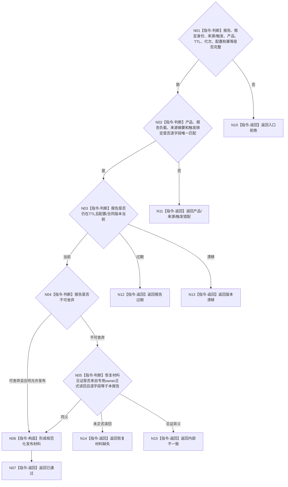

# BIZ-L3-006-04-01 复核外设报告发布合同目标函数流程图 v0.2

更新时间：2026-08-27

## 依据

```text
6340 v0.6、6350 v0.6、6360；BIZ-L2-006-04 v0.2
```

## 身份与边界

正式目标函数设计图。纯值复核报告来源、触发、产品唯一性、TTL、生产代次、幂等身份和恢复要求；不保存恢复材料、不发布队列项。不可舍弃报告只有在专用恢复owner已保存并正式读回同一报告后才取得物理队列发布资格。

## 函数合同

```text
根函数：复核外设报告发布合同
归属模块 / 文件 / 目标分解深度：外设报告发布协议 / 海中鱼巣/线程/协议.外设报告发布.ixx / BIZ-L3
现有或待新增：待新增纯值函数
完整签名：外设报告发布合同复核结果 复核外设报告发布合同(const 外设报告发布合同复核请求& 请求) noexcept
参数：请求为只读借用；含不可变报告、稳定身份、来源/触发见证、产品、TTL、生产代次、配置版本、幂等身份、当前时间，以及不可舍弃报告的恢复材料正式读回见证
返回结果：值式结果；含已通过、报告过期、产品错配、恢复材料缺失、版本漂移、入口拒绝或内部不一致，以及规范化发布材料
被调函数流程图：无；字段、TTL、产品和恢复前置均为本函数内指令
父图：BIZ-L2-006-04 v0.2
```

## 流程图



## 关键边界

发布资格不等于恢复材料已保存、不等于报告已进入物理队列，更不等于任务域已经正式承接。
