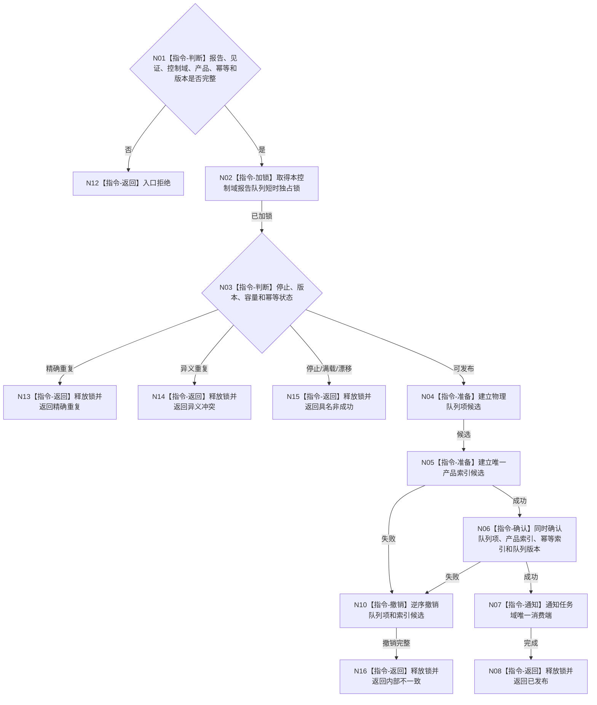

# BIZ-L3-006-04-02 原子提交外设报告与产品索引目标函数流程图 v0.1

更新时间：2026-08-03

## 依据

```text
6340、6350；BIZ-L2-006-04
```

## 身份与边界

正式目标函数设计图。把一个报告候选和唯一产品索引在同一队列事务中发布；索引只作可重建定位投影。

## 函数合同

```text
根函数：外设报告物理队列::原子提交报告与唯一产品索引
归属模块 / 文件 / 层级：外设报告物理队列 / 海中鱼巣/线程/外设报告物理队列.ixx / L3
现有或待新增：待新增；一个控制域一个物理队列
完整签名：外设报告队列发布结果 外设报告物理队列::原子提交报告与唯一产品索引(const 外设报告队列发布请求& 请求)
参数：请求为只读借用；含规范化报告、发布见证、控制域、报告身份、唯一产品类型、幂等键和期望队列版本
返回结果：值式结果；含已发布、精确重复、容量暂不可用、停止中、异义冲突、版本漂移或内部不一致，以及发布序号和队列版本
被调函数流程图：无；短时锁内候选、索引、确认和撤销均为本函数内指令
父图：BIZ-L2-006-04
```

## 流程图



## 节点合同

| 节点 | 类型 | 参数 / 输入绑定 | 结果 / 输出绑定 | 事实读写 | 后继条件 | 验证 |
| --- | --- | --- | --- | --- | --- | --- |
| N02/N03 | 指令 | 请求与队列状态 | 发布资格 | 锁内传递结构 | 可发布或非成功 | 满载、停止、重复、版本 |
| N04—N06 | 指令 | 规范化报告 | 队列项与唯一索引 | 原子发布传递结构 | 全确认或全撤销 | 半发布、跨产品重复 |
| N07/N08 | 指令 | 已发布报告 | 消费端通知 | 无业务写入 | 完成 | 通知不等于承接 |

## 关键边界

队列和产品索引不是长期权威；同一报告跨任务、窗口和代次至多一次正式承接由任务域治理事实裁决。

