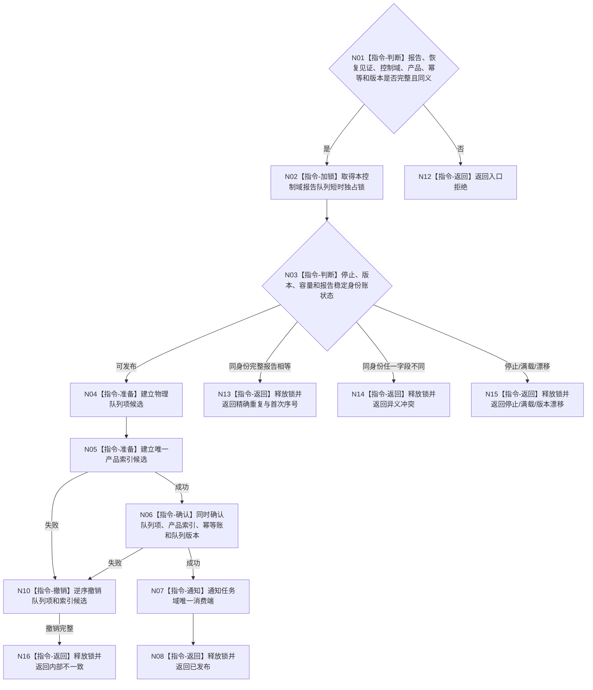

# BIZ-L3-006-04-02 原子提交外设报告与产品索引目标函数流程图 v0.2

更新时间：2026-08-27

## 依据

```text
6340 v0.6、6350 v0.6；BIZ-L2-006-04 v0.2
```

## 身份与边界

正式目标函数设计图。把一份已经通过恢复前置与发布复核的报告和唯一产品索引在同一运行期队列事务中发布；索引只作可重建定位投影。物理队列、产品索引、D455缓存和线程消息均不是跨重启恢复权威。

## 函数合同

```text
根函数：外设报告物理队列::原子提交报告与唯一产品索引
归属模块 / 文件 / 目标分解深度：外设报告物理队列 / 海中鱼巣/线程/外设报告物理队列.ixx / BIZ-L3
现有或待新增：待新增；一个控制域一个物理队列
完整签名：外设报告队列发布结果 外设报告物理队列::原子提交报告与唯一产品索引(const 外设报告队列发布请求& 请求) noexcept
参数：请求为只读借用；含规范化报告、恢复正式读回见证、控制域、报告稳定身份、唯一产品类型、幂等身份和期望队列版本
返回结果：值式结果；含已发布、精确重复、容量暂不可用、停止中、异义冲突、版本漂移或内部不一致，以及首次发布序号和队列版本
被调函数流程图：无；短时锁内候选、索引、确认和撤销均为本函数内指令
父图：BIZ-L2-006-04 v0.2
```

## 流程图



## 原子与唯一性合同

- 报告稳定身份是唯一竞争键；任务、窗口、生产代次、恢复代次和队列版本不得进入复合键放宽唯一性。
- 同身份完整报告逐字段相等返回精确重复并回显首次发布序号；同身份任一字段不同返回异义冲突。
- 通知失败不得回滚已发布队列项；恢复owner的正式材料仍可驱动同键恢复，不能重新采样或换键。

## 关键边界

队列和产品索引只负责运行期交付。跨重启恢复、同报告身份收敛和任务域正式承接分别由专用恢复owner与6340承接治理负责。
