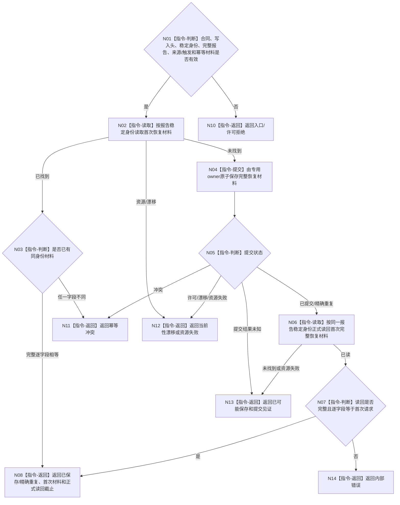

# BIZ-L3-006-04-03 保存并正式读回不可舍弃外设报告恢复材料目标函数流程图 v0.1

更新时间：2026-08-27

## 依据

```text
4020、6340 v0.6、6350 v0.6、6360；BIZ-L2-006-04 v0.2
```

## 身份与边界

正式目标函数设计图。专用外设报告恢复owner在物理队列发布前保存一份不可舍弃报告的完整恢复材料，并按同一报告稳定身份正式读回。该owner只保证跨重启恢复和同身份收敛，不把报告解释为世界事实、任务结果或6340正式承接事实。

## 函数合同

```text
根函数：外设报告恢复服务::保存并读取不可舍弃报告恢复材料
归属模块 / 文件 / 目标分解深度：外设报告恢复owner / 海中鱼巣/领域/外设材料/服务.外设报告恢复.ixx / BIZ-L3
现有或待新增：待新增专用持久owner和正式读回入口
完整签名：外设报告恢复结果 外设报告恢复服务::保存并读取不可舍弃报告恢复材料(const 外设报告恢复请求& 请求) noexcept
参数：请求为只读借用；含专属合同版本、共同写入头、报告稳定身份、完整不可变报告、来源/触发见证、恢复幂等身份和预期owner代次
返回结果：值式结果；含已保存、精确重复、入口拒绝、许可拒绝、当前性漂移、幂等冲突、资源失败、内部错误或已可能保存；成功携带首次完整恢复材料和正式读回截止，已可能保存只携带提交见证
被调函数流程图：无；专用owner事务和正式读回均为本函数内指令
父图：BIZ-L2-006-04 v0.2
```

## 流程图



## 状态与恢复合同

- 同一报告稳定身份的完整恢复材料逐字段相等为精确重复，零第二次权威副作用；任一字段不同为幂等冲突。
- 提交已确认但读回失败，或提交结果无法确定时，只返回`已可能保存`及原提交见证；调用方后续必须原身份、原完整请求重试。
- 跨生产代次和恢复代次仍按同一报告稳定身份命中首次材料；禁止换代次、任务或窗口形成第二报告。
- 只有正式读回完整且截止非零才允许BIZ-L3-006-04-01把不可舍弃报告判为可进入运行期物理队列。

## 关键边界

恢复材料是外设报告交付的持久守恒证据，不是报告的正式业务消费、世界事实、任务结果或需求满足结论。
