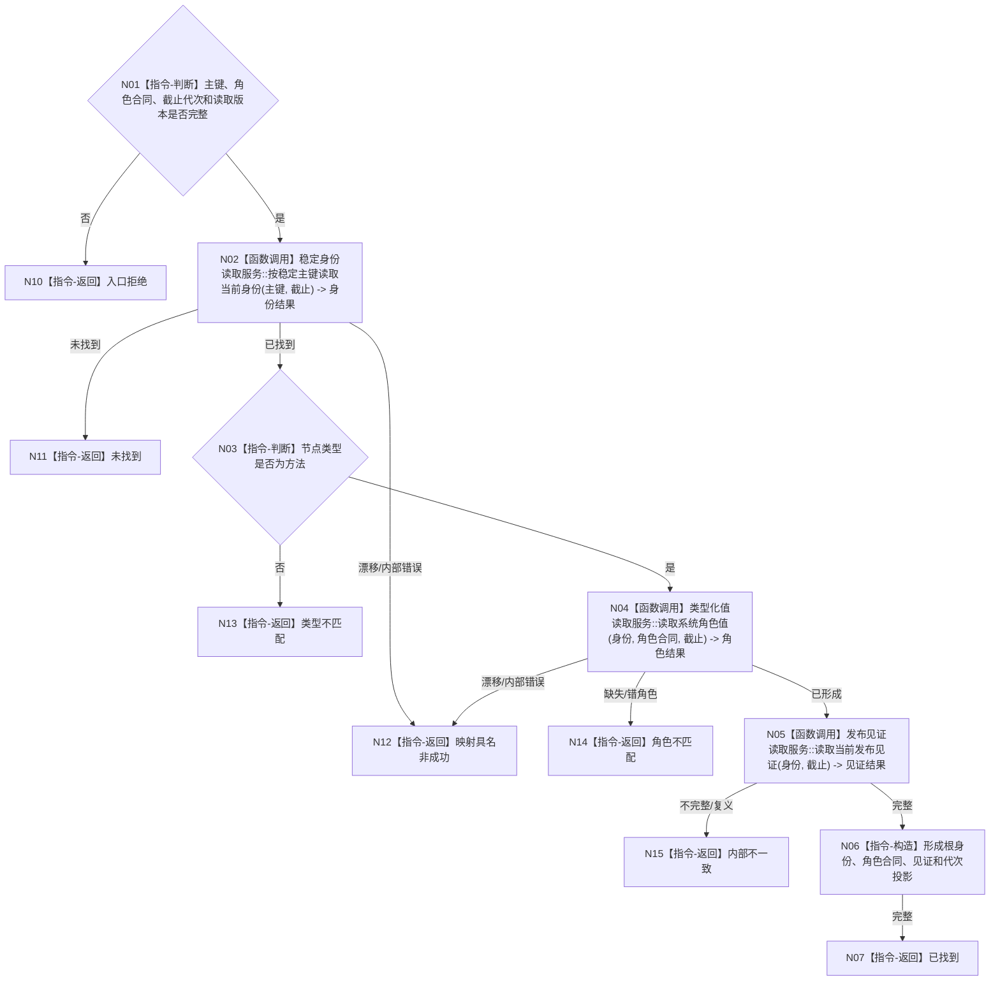

# BIZ-L4-001-03-01-01 读取当前方法登记根目标函数流程图 v0.1

更新时间：2026-08-03

## 依据

```text
3300、4010—4030、5300、8120；BIZ-L3-001-03-01
当前代码按主键读取可作候选；旧模板关系0/40/41不符合现行根逻辑
```

## 身份与边界

正式目标函数设计图。按固定系统角色稳定主键读取方法登记根完整投影；不得从名称、旧模板关系、共享抽象状态或方法首关系23猜测根身份。

## 函数合同

```text
根函数：方法业务服务::读取当前方法登记根
归属模块 / 文件 / 层级：方法领域服务 / 海中鱼巣/领域/服务.方法.ixx / L4
现有或待新增：目标替换；复用按主键读取，删除旧模板0/40/41解释
完整签名：方法登记根读取结果 方法业务服务::读取当前方法登记根(const 方法登记根读取请求& 请求) const
参数：请求为只读借用；含固定角色稳定主键、角色合同身份与版本、事实截止代次和读取合同版本；零身份或隐式最新非法
返回结果：不可变值式结果；含已找到、未找到、类型不匹配、角色不匹配、版本漂移、入口拒绝或内部不一致，以及根身份、角色合同、发布见证和事实代次
被调函数流程图：具名L1稳定身份、类型化系统角色值和发布见证读取；通用数据服务内部实现不在目标业务图重复
父图：BIZ-L3-001-03-01
```

## 流程图



## 节点合同

| 节点 | 类型 | 参数 / 输入绑定 | 结果 / 输出绑定 | 事实读写 | 后继条件 | 验证 |
| --- | --- | --- | --- | --- | --- | --- |
| N02 | 函数调用 | 主键和截止 | 身份投影 | 只读身份服务 | 找到或非成功 | 索引重建等价 |
| N04 | 函数调用 | 身份和角色合同 | 类型化角色值 | 只读值服务 | 唯一匹配 | 禁止名称/模板推断 |
| N05/N06 | 函数调用/指令 | 身份与角色 | 完整根投影 | 只读见证 | 完整一致 | 同代次、无半发布 |

## 关键边界

方法登记根是永久系统角色根，不拥有普通方法首的治理虚拟存在，也不使用关系23生命周期。未找到是冷启动结果；同主键复义或半发布是内部不一致。
