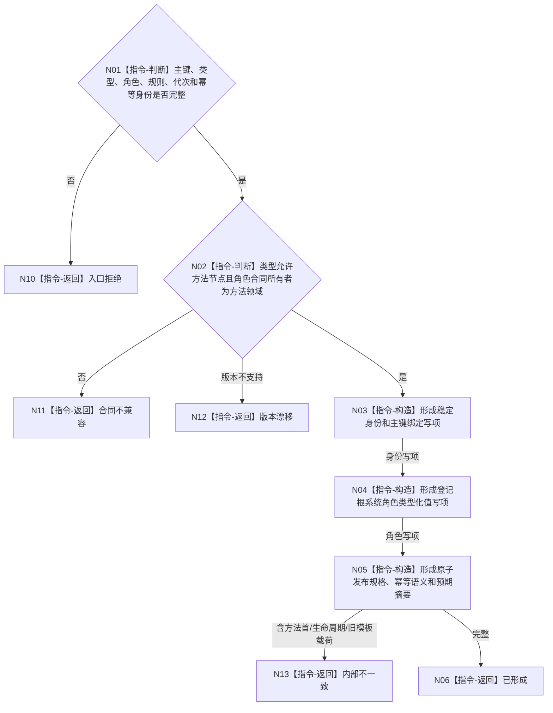

# BIZ-L4-001-03-01-02 形成方法登记根写入规格目标函数流程图 v0.1

更新时间：2026-08-03

## 依据

```text
3300、4010—4030、5300、8120；BIZ-L3-001-03-01
```

## 身份与边界

正式目标函数设计图。形成业务中性身份写项和方法领域系统角色写项；不创建方法首、治理虚拟存在、方法生命周期或动作入口。

## 函数合同

```text
根函数：形成方法登记根写入规格
归属模块 / 文件 / 层级：方法登记根协议 / 海中鱼巣/领域/协议.方法登记根.ixx / L4
现有或待新增：目标替换；删除角色/活跃/失效三个旧抽象状态及模板关系
完整签名：方法登记根写入规格形成结果 形成方法登记根写入规格(const 方法登记根写入规格形成请求& 请求) noexcept
参数：请求为只读借用；含固定主键、方法节点类型合同、登记根系统角色合同身份与版本、规则版本、预期事实代次和幂等身份
返回结果：值式结果；含已形成、入口拒绝、合同不兼容、版本漂移或内部不一致，以及身份写项、系统角色值写项、发布规格和预期读回摘要
被调函数流程图：无；字段互证和不可变写项构造均为本函数内纯值指令
父图：BIZ-L3-001-03-01
```

## 流程图



## 节点合同

| 节点 | 类型 | 参数 / 输入绑定 | 结果 / 输出绑定 | 事实读写 | 后继条件 | 验证 |
| --- | --- | --- | --- | --- | --- | --- |
| N01/N02 | 指令 | 请求合同 | 规格资格 | 无写入 | 兼容或拒绝 | 所有者、版本、零身份 |
| N03/N04 | 指令 | 合法请求 | 两类写项 | 无写入 | 构造完成 | 主键唯一、角色强类型 |
| N05/N06 | 指令 | 写项和幂等材料 | 发布规格 | 无写入 | 完整 | 禁止旧模板/共享状态 |

## 关键边界

根的永久性来自固定系统角色合同与退役规则，不通过“活跃/失效模板状态”模拟普通方法生命周期。

