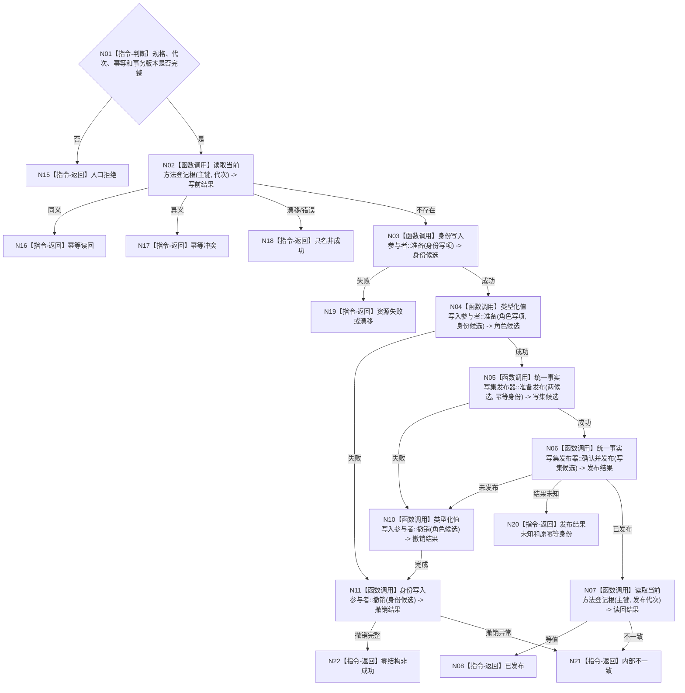

# BIZ-L4-001-03-01-03 发布方法登记根事务目标函数流程图 v0.1

更新时间：2026-08-03

> 历史冻结（2026-08-14）：父图 `BIZ-L3-001-03-01` 已退出当前初始化链；本图无当前父合同，不得施工或自动改挂 03-10。

## 依据

```text
3300、4010—4040、5300、8120；BIZ-L3-001-03-01；BIZ-L4-001-03-01-01/02
```

## 身份与边界

正式目标函数设计图。方法领域唯一写入方把身份和系统角色值作为一个事实写集发布；任一参与者失败逆序撤销，结果未知只允许原幂等身份读回。

## 函数合同

```text
根函数：方法数据操作::发布方法登记根事务
归属模块 / 文件 / 层级：方法登记数据操作 / 海中鱼巣/领域/数据操作.方法登记.ixx / L4
现有或待新增：目标替换；复用节点直接身份事务与统一事实写集，删除旧模板关系写入
完整签名：方法登记根发布结果 方法数据操作::发布方法登记根事务(const 方法登记根发布请求& 请求)
参数：请求为只读借用；含不可变写入规格、预期事实代次、幂等身份和事务合同版本
返回结果：值式结果；含已发布、幂等读回、幂等冲突、版本漂移、资源失败、发布结果未知或内部不一致，以及发布代次、根身份和发布见证
被调函数流程图：身份写入参与者、类型化值写入参与者、统一事实写集发布器和BIZ-L4-001-03-01-01；通用参与者内部实现不重复
父图：BIZ-L3-001-03-01
```

## 流程图



## 节点合同

| 节点 | 类型 | 参数 / 输入绑定 | 结果 / 输出绑定 | 事实读写 | 后继条件 | 验证 |
| --- | --- | --- | --- | --- | --- | --- |
| N02 | 函数调用 | 主键和代次 | 写前结果 | 只读方法根 | 不存在、同义、冲突 | 并发首次创建 |
| N03/N04 | 函数调用 | 两类写项 | 参与者候选 | 候选不可见 | 全准备或撤销 | 故障点、资源失败 |
| N05/N06 | 函数调用 | 候选和幂等身份 | 原子发布结果 | 发布新代次 | 发布/未发布/未知 | 半发布禁止 |
| N10/N11 | 函数调用 | 已准备候选 | 逆序撤销 | 清除候选 | 完整或错误 | 撤销顺序 |
| N07/N08 | 函数调用/返回 | 发布代次 | 完整根材料 | 只读发布事实 | 等值 | 写后读回 |

## 关键边界

不得顺带创建普通方法首、治理虚拟存在、关系23生命周期、任务选择或动作入口；结果未知时禁止换主键或新幂等身份重试。
