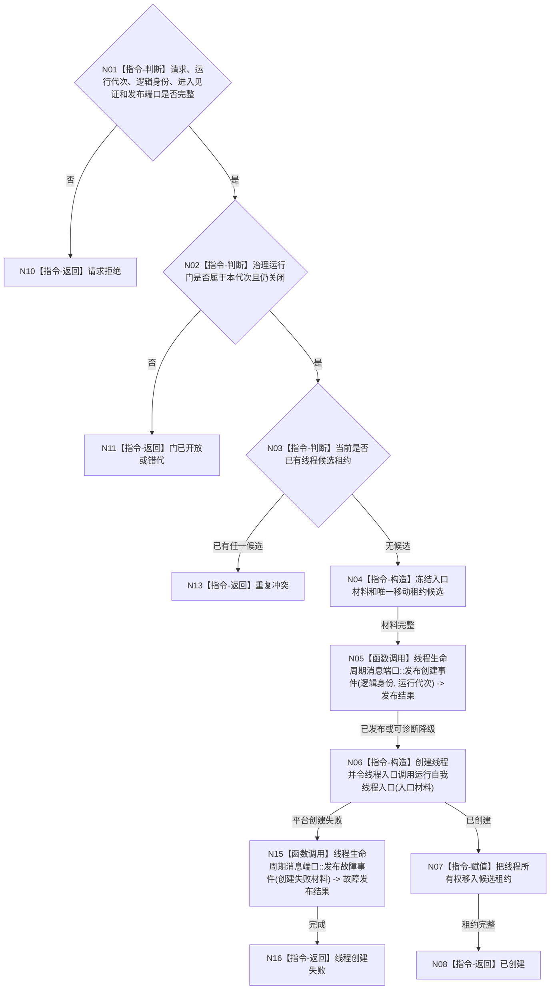

# BIZ-L4-001-03-02-01 创建自我线程候选目标函数流程图 v0.1

更新时间：2026-08-03

> 历史冻结（2026-08-14）：父图 `BIZ-L3-001-03-02` 已退出当前初始化链；本图无当前父合同，不得施工或自动改挂 03-10。

## 依据

```text
8100、8110、8120、8200；BIZ-L3-001-03-02
当前 CAP-0007 / F0044 可复用 std::thread 创建和成员生命周期，但缺运行代次、关闭治理门、进入见证与租约回收合同
```

## 身份与边界

正式目标函数设计图。只构造一个绑定运行代次、线程逻辑身份和关闭治理门的自我线程候选，并把线程所有权封装为唯一可移动租约；不等待初始化完成，不开放治理门，也不裁决任何业务事实。

## 函数合同

```text
根函数：自我线程::创建自我线程候选
归属模块 / 文件 / 层级：自我线程 / 海中鱼巣/线程/自我线程.ixx / L4
现有或待新增：适配扩展；复用当前线程创建，补齐代次、门、进入见证、生命周期消息和移动租约
完整签名：自我线程候选创建结果 自我线程::创建自我线程候选(const 自我线程候选创建请求& 请求)
参数：请求为只读借用；含非零运行代次、唯一线程逻辑身份、初始化输入、处于关闭态的治理运行门身份、初始化进入见证身份、线程生命周期发布端口和启动幂等身份；函数返回前复制或冻结线程入口所需材料
返回结果：移动值式结果；含已创建、请求拒绝、重复冲突、门已开放、线程创建失败或内部不一致；成功时含唯一可移动自我线程候选租约和进入见证身份
被调函数流程图：BIZ-L4-001-03-02-02 运行自我线程入口；8110生命周期消息形成与提交使用共享线程合同，不在本图复制
父图：BIZ-L3-001-03-02
```

## 流程图



## 节点合同

| 节点 | 类型 | 参数 / 输入绑定 | 结果 / 输出绑定 | 事实读写 | 后继条件 | 验证 |
| --- | --- | --- | --- | --- | --- | --- |
| N02/N03 | 指令-判断 | 门、代次、幂等身份和当前租约 | 准入结论 | 只读线程本地状态 | 唯一候选 | 并发双启动、错代与开放门 |
| N05/N15 | 函数调用 | 线程逻辑身份和创建/故障材料 | 生命周期发布结果 | 只写8110线程投影输入 | 已发布或可诊断降级 | 消息不进入自我治理邮箱且失败不阻断业务启动 |
| N06/N07 | 指令 | 冻结入口材料 | 可移动线程候选租约 | 只改线程运行资源 | 平台创建成功 | 无分离线程、无裸线程所有权 |

## 关键边界

创建事件是线程投影，不是自我初始化或业务事实。平台线程创建成功之前不得返回租约；创建成功后不得 `detach`。候选租约只允许交给启动成功路径或 BIZ-L4-001-03-02-04 回收路径，析构不得静默丢弃仍可连接线程。
