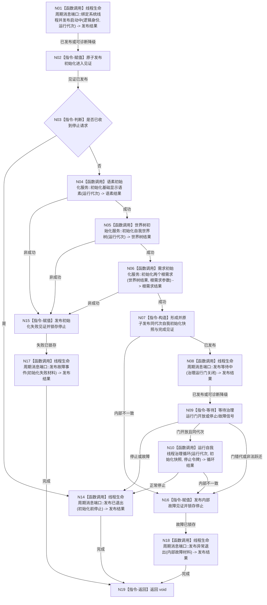

# BIZ-L4-001-03-02-02 运行自我线程入口目标函数流程图 v0.1

更新时间：2026-08-03

> 历史冻结（2026-08-14）：父图 `BIZ-L3-001-03-02` 已退出当前初始化链；本图无当前父合同，不得施工或自动改挂 03-10。

## 依据

```text
8100、8110、8120、8200；BIZ-L1-T02、BIZ-L3-001-03-02
当前 CAP-0007 / F0044 的线程 lambda 与私有执行初始化可复用初始化顺序，但当前代码初始化后直接运行治理循环，不满足关闭治理门后置条件
```

## 身份与边界

正式目标函数设计图。它是候选线程的唯一入口：先发布进入见证，再按 8120 完成自我初始化，冻结初始化快照，停在关闭的治理运行门；只有后续正式开放门后才调用自我治理循环。线程生命周期投影与业务初始化结果分账。

## 函数合同

```text
根函数：自我线程::运行自我线程入口
归属模块 / 文件 / 层级：自我线程 / 海中鱼巣/线程/自我线程.ixx / L4
现有或待新增：目标替换；复用现行执行初始化和治理循环，增加代次、门、进入/完成见证及不抛出线程边界
完整签名：void 自我线程::运行自我线程入口(自我线程入口材料 入口材料) noexcept
参数：入口材料按值取得并由线程独占；含运行代次、逻辑身份、根需求初始化参数、关闭治理门、进入与初始化完成见证、停止令牌、生命周期发布端口和初始化服务引用租约；所有引用租约必须长于线程候选
返回结果：void；所有逻辑结果写入具名进入/初始化/退出见证和线程生命周期消息，所有异常收束为内部故障见证；调用者只通过见证和连接结果观察完成
被调函数流程图：BIZ-L1-T02 自我线程治理循环；语素、世界树、根需求初始化使用其各自正式服务合同，不在本图展开
父图：BIZ-L3-001-03-02
```

## 流程图



## 节点合同

| 节点 | 类型 | 参数 / 输入绑定 | 结果 / 输出绑定 | 事实读写 | 后继条件 | 验证 |
| --- | --- | --- | --- | --- | --- | --- |
| N01/N02 | 函数调用/指令 | 逻辑身份、代次和进入见证 | 启动中投影与进入见证 | 线程投影和本地见证 | 投影可诊断降级、见证必须唯一发布 | 系统线程ID只作诊断且投影失败不阻断初始化 |
| N04—N07 | 函数调用/指令 | 初始化服务与根需求参数 | 同代次初始化快照 | 领域服务各自写正式事实；线程只发布快照 | 三项全成功 | 半快照不可读、已发布事实不补删 |
| N08/N09 | 函数调用/指令 | 关闭治理门、停止令牌 | 等待或开放结论 | 只改线程投影 | 同代次开放 | 门关闭时零治理消息消费 |
| N10 | 函数调用 | 初始化快照和停止令牌 | 循环结果 | 治理循环按领域写权工作 | 门已正式开放 | 引用BIZ-L1-T02 |
| N15—N19 | 指令/函数调用 | 初始化或内部故障 | 失败见证与退出投影 | 不撤销已发布业务事实 | 必须收束 | noexcept边界、异常注入 |

## 关键边界

进入见证只证明线程入口已取得执行权，不证明初始化成功；初始化完成见证只证明 8120 的自我线程内部三项快照完整，不证明概念四根、存在根支持或治理循环已经开放。停止发生在初始化写入之后时，已经正式发布的幂等领域事实保留，不以删除或反向补偿伪装为“未启动”。
