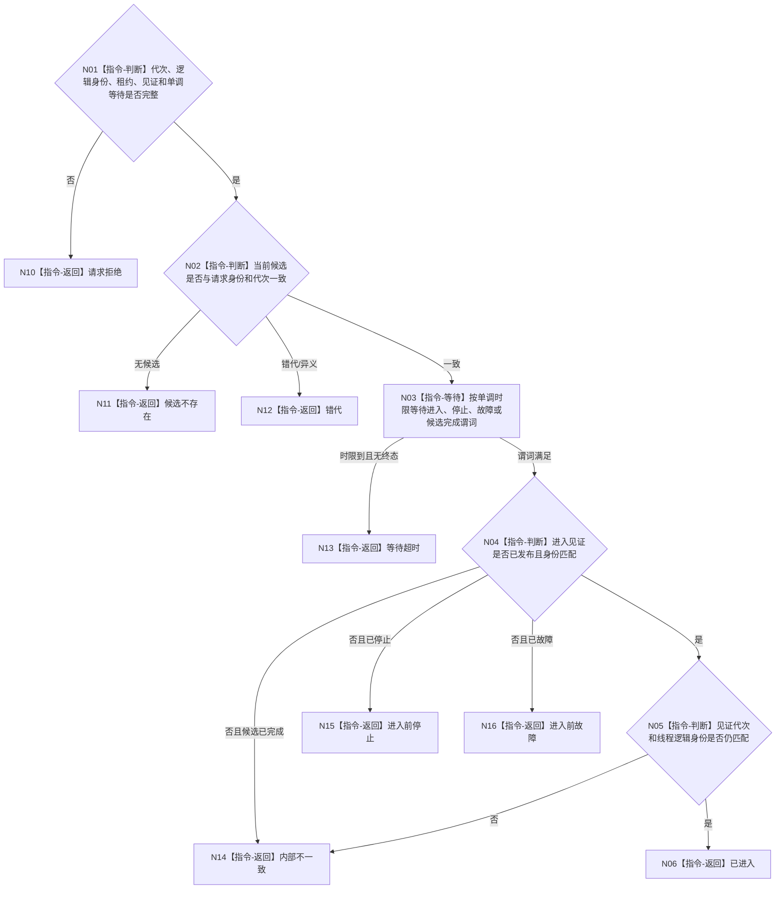

# BIZ-L4-001-03-02-03 等待自我线程进入见证目标函数流程图 v0.1

更新时间：2026-08-03

## 依据

```text
8110、8120；BIZ-L3-001-03-02
当前 CAP-0007 的条件变量可复用，但 F0044 启动立即返回且 F0045 等待的是初始化完成，二者都不是具名初始化进入见证
```

## 身份与边界

正式目标函数设计图。只等待指定候选线程在指定运行代次发布“已进入初始化入口”见证；不得把线程对象已创建、系统线程 ID 已绑定或初始化快照已形成互相替代。

## 函数合同

```text
根函数：自我线程::等待自我线程进入见证
归属模块 / 文件 / 层级：自我线程 / 海中鱼巣/线程/自我线程.ixx / L4
现有或待新增：待新增；复用条件变量等待机制，冻结具名见证和单调时限合同
完整签名：自我线程进入等待结果 自我线程::等待自我线程进入见证(const 自我线程进入等待请求& 请求) const
参数：请求为只读借用；含运行代次、线程逻辑身份、候选租约身份、预期进入见证身份和非零单调最长等待；隐式最新、系统墙钟截止和零时限非法
返回结果：不可变值式结果；含已进入、请求拒绝、候选不存在、错代、进入前停止、进入前故障、等待超时或内部不一致，以及已发布进入见证和当前线程生命周期投影
被调函数流程图：无；条件变量等待、谓词复核和结果构造均为本函数内指令
父图：BIZ-L3-001-03-02
```

## 流程图



## 节点合同

| 节点 | 类型 | 参数 / 输入绑定 | 结果 / 输出绑定 | 事实读写 | 后继条件 | 验证 |
| --- | --- | --- | --- | --- | --- | --- |
| N02 | 指令-判断 | 租约身份、逻辑身份和代次 | 候选一致性 | 只读线程本地状态 | 候选唯一 | 旧租约、异义候选 |
| N03 | 指令-等待 | 单调最长等待和终止谓词 | 唤醒原因 | 无 | 见证/终态/超时 | 伪唤醒、墙钟跳变 |
| N04/N05 | 指令-判断 | 进入见证 | 已进入或具名非成功 | 只读见证和生命周期投影 | 身份与代次一致 | 线程创建不替代进入 |

## 关键边界

等待超时不是线程创建失败，也不授权销毁或分离候选；调用者必须把候选租约交给 BIZ-L4-001-03-02-04。该结果不等待初始化完成，后续仍必须调用 BIZ-L3-001-03-03 和 BIZ-L3-001-03-04。
