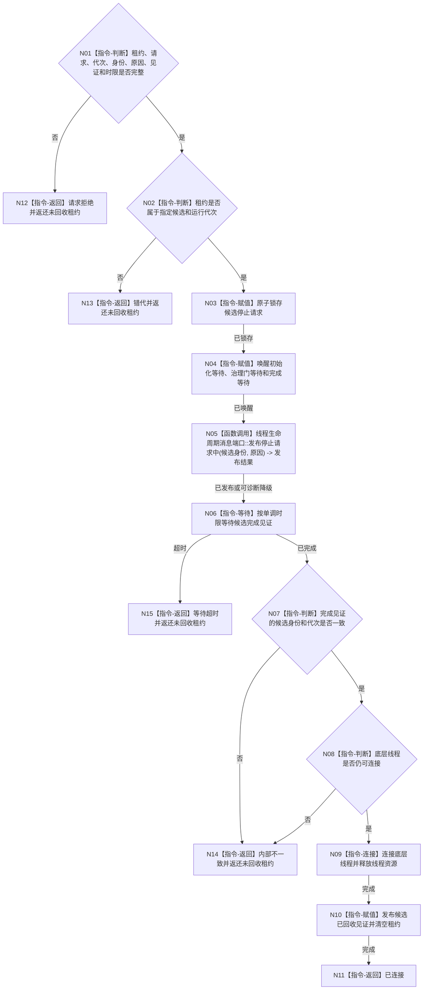

# BIZ-L4-001-03-02-04 停止并连接自我线程启动候选目标函数流程图 v0.1

更新时间：2026-08-03

## 依据

```text
8100、8110、8120；BIZ-L3-001-03-02
当前 CAP-0007 的请求停止、条件唤醒和 join 可复用；目标合同补齐候选租约、完成见证、单调时限和不可分离规则
```

## 身份与边界

正式目标函数设计图。只在启动未取得进入见证或创建后发生具名失败时，请求指定候选停止并在完成见证后连接线程；它回收线程资源，不撤销或删除初始化期间已经正式发布的领域事实，也不替代普通运行期分阶段停机。

## 函数合同

```text
根函数：自我线程::停止并连接自我线程启动候选
归属模块 / 文件 / 层级：自我线程 / 海中鱼巣/线程/自我线程.ixx / L4
现有或待新增：适配扩展；复用停止锁存、条件唤醒和 join，增加唯一租约、时限完成见证与未回收租约返还
完整签名：自我线程候选回收结果 自我线程::停止并连接自我线程启动候选(自我线程候选租约&& 候选租约, const 自我线程候选回收请求& 请求) noexcept
参数：候选租约为唯一移动所有权；请求为只读借用，含运行代次、逻辑身份、回收原因、完成见证身份和非零单调最长等待；函数消费租约，未完成连接时必须在结果中返还唯一未回收租约
返回结果：移动值式结果；含已连接、请求拒绝、错代、停止请求失败、等待超时或内部不一致；未连接时含唯一未回收租约和当前完成见证，禁止丢失线程所有权
被调函数流程图：8110生命周期消息形成与提交使用共享线程合同；其它均为本函数内停止、等待和连接指令
父图：BIZ-L3-001-03-02
```

## 流程图



## 节点合同

| 节点 | 类型 | 参数 / 输入绑定 | 结果 / 输出绑定 | 事实读写 | 后继条件 | 验证 |
| --- | --- | --- | --- | --- | --- | --- |
| N02—N04 | 指令 | 唯一租约和停止请求 | 停止锁存与唤醒 | 只改线程运行状态 | 同候选同代次 | 重复停止、错代租约 |
| N05 | 函数调用 | 候选身份和回收原因 | 生命周期发布结果 | 只写8110线程投影输入 | 不阻断停止锁存 | 控制面板不可用 |
| N06/N07 | 指令 | 完成见证和单调时限 | 已完成或超时 | 无 | 完成身份一致 | 超时、伪唤醒 |
| N08—N10 | 指令 | 已完成租约 | 连接和回收见证 | 释放线程资源 | 只连接一次 | 禁止detach、双join |

## 关键边界

只有见到候选完成后才能执行无时限 `join`，从而避免把时限合同伪装在不可中断连接上。超时或内部不一致时结果必须返还仍拥有底层线程的租约，交由程序宿主保留并升级故障；不得析构、分离、覆盖或遗失。候选回收不等于 BIZ-L2-001-11—15 的正式停机链。
