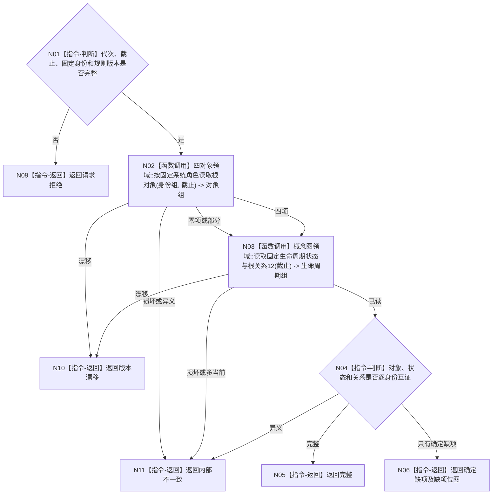

# BIZ-L4-001-03-05-01 读取四个概念根权威事实目标函数流程图 v0.1

更新时间：2026-08-03

> 状态：历史失效
>
> 替代：`BIZ-L3-001-03-09`
>
> 以下正文仅保留历史证据，不得作为规范、详细设计、计划或施工依据。

## 依据

```text
0050、4190、7140；BIZ-L3-001-03-05
```

## 身份与边界

正式目标函数设计图。分别向存在、动态、二次特征、因果和概念图领域读取同一事实截止内的四根对象、三个固定生命周期状态和四条当前关系12；只组合值式材料，不以登记、名称或活动投影补缺。

## 函数合同

```text
根函数：概念图初始化读取器::读取四个概念根权威事实
归属模块 / 文件 / 层级：概念图初始化读取 / 海中鱼巣/领域/读取.概念图初始化.ixx / L4
现有或待新增：待新增；复用各对象领域和概念图领域公开只读入口
完整签名：概念根权威读取结果 概念图初始化读取器::读取四个概念根权威事实(const 概念根权威读取请求& 请求) const
参数：请求为只读借用；含运行代次、事实截止向量、四类固定系统角色稳定主键、三个固定生命周期状态身份和7140规则版本
返回结果：不可变值式结果；含完整、确定缺项、版本漂移或内部不一致，以及逐根对象结构、状态、关系12和逐提供者见证
被调函数流程图：无新增目标函数；逐领域公开读取是已存在或由对应领域计划提供的能力，父函数仅作同截止互证
父图：BIZ-L3-001-03-05
```

## 流程图



## 节点合同

| 节点 | 类型 | 输入 | 输出 | 事实读写 | 验证 |
| --- | --- | --- | --- | --- | --- |
| N02/N03 | 函数调用 | 固定身份与截止 | 各领域值式材料 | 只读正式事实 | 空、部分、多当前、版本漂移 |
| N04—N06 | 指令 | 多领域材料 | 完整或缺项位图 | 无 | 不跨代次拼接，不采信投影 |

## 关键边界

确定缺项是可恢复初始化输入，不等于结构损坏；稳定身份异义、同类多根或多当前生命周期必须作为内部不一致返回。
