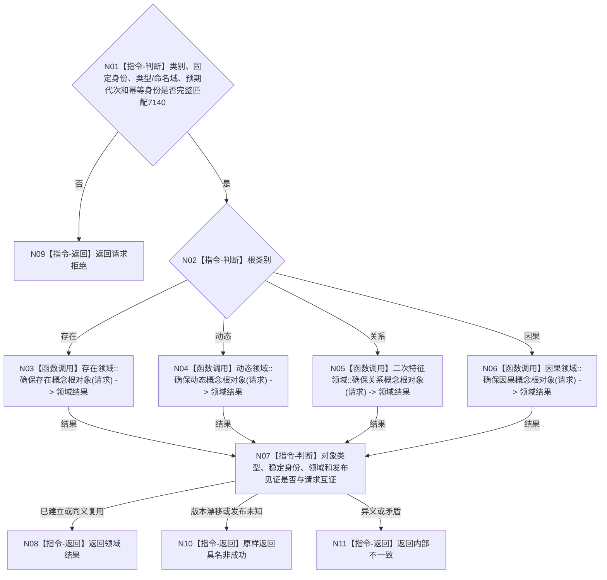

# BIZ-L4-001-03-05-02 确保一个概念根对象目标函数流程图 v0.1

更新时间：2026-08-03

> 历史冻结（2026-08-14）：本父图已由 `BIZ-L3-001-03-09` 正式替代；父图旧四对象领域、关系12和固定生命周期状态语义永久失效；正文仅保留历史证据，不得施工或自动改挂03-10。

## 依据

```text
0050、4190、7140；BIZ-L3-001-03-05
```

## 身份与边界

正式目标函数设计图。按根类别把固定身份请求路由到唯一对象领域；每次只形成一个领域自己的根对象写集，不写关系12，也不跨四领域原子发布。

## 函数合同

```text
根函数：概念图初始化服务::确保一个概念根对象
归属模块 / 文件 / 层级：概念图初始化服务 / 海中鱼巣/领域/初始化.概念图.ixx / L4
现有或待新增：目标替换；复用四对象领域根创建能力，补齐预期代次和幂等结果
完整签名：单概念根确保结果 概念图初始化服务::确保一个概念根对象(const 单概念根确保请求& 请求)
参数：请求为只读借用；含根类别、对应固定系统角色稳定主键、对象领域预期代次、节点类型/命名域合同版本和逐根幂等身份
返回结果：不可变值式结果；含已建立、同义复用、请求拒绝、异义冲突、版本漂移、发布结果未知或内部不一致，以及根对象、所属领域和发布见证
被调函数流程图：存在领域::确保存在概念根对象、动态领域::确保动态概念根对象、二次特征领域::确保关系概念根对象、因果领域::确保因果概念根对象；各调用均只写本领域
父图：BIZ-L3-001-03-05
```

## 流程图



## 节点合同

| 节点 | 类型 | 输入 | 输出 | 事实读写 | 验证 |
| --- | --- | --- | --- | --- | --- |
| N02—N06 | 判断 / 函数调用 | 单根请求 | 唯一领域结果 | 只由所属对象领域写入 | 四类别路由、错域拒绝 |
| N07/N08 | 指令 | 领域结果 | 标准单根结果 | 无 | 身份、类型、域和见证互证 |

## 关键边界

一个根对象发布后即保留；后续生命周期失败不得删除或回滚它。重试必须使用原稳定身份和幂等身份，同键异义必须拒绝。
