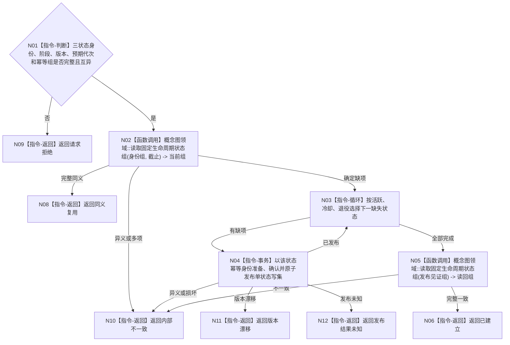

# BIZ-L4-001-03-05-03 确保概念生命周期固定状态组目标函数流程图 v0.1

更新时间：2026-08-03

> 状态：历史失效
>
> 替代：`BIZ-L3-001-03-09`
>
> 以下正文仅保留历史证据，不得作为规范、详细设计、计划或施工依据。

## 依据

```text
0050、7140；BIZ-L3-001-03-05
```

## 身份与边界

正式目标函数设计图。由概念图领域按固定身份幂等确保活跃、冷却、退役三个生命周期状态；状态是关系12的目标，不因四根是否齐全改变身份。

## 函数合同

```text
根函数：概念图业务服务::确保生命周期固定状态组
归属模块 / 文件 / 层级：概念图业务服务 / 海中鱼巣/领域/服务.概念活动.ixx / L4
现有或待新增：适配扩展；替换现行无版本初始化入口
完整签名：概念生命周期固定状态结果 概念图业务服务::确保生命周期固定状态组(const 概念生命周期固定状态请求& 请求)
参数：请求为只读借用；含三个固定状态稳定身份、阶段合同版本、预期概念事实代次和逐状态幂等身份
返回结果：不可变值式结果；含已建立、同义复用、请求拒绝、异义冲突、版本漂移、发布结果未知或内部不一致，以及三状态和发布见证组
被调函数流程图：无新增目标函数；三状态候选准备、确认、撤销和逐状态原子发布由概念图领域内部事务指令完成
父图：BIZ-L3-001-03-05
```

## 流程图



## 节点合同

| 节点 | 类型 | 输入 | 输出 | 事实读写 | 验证 |
| --- | --- | --- | --- | --- | --- |
| N02/N05 | 函数调用 | 固定身份与见证 | 状态组 | 只读概念图事实 | 三状态唯一和互异 |
| N03/N04 | 指令 | 单状态缺项 | 发布见证 | 概念图领域单状态写集 | 失败不回滚既有状态 |

## 关键边界

固定状态组不代表任一概念当前处于对应阶段；具体当前阶段只能由关系12事实建立。
