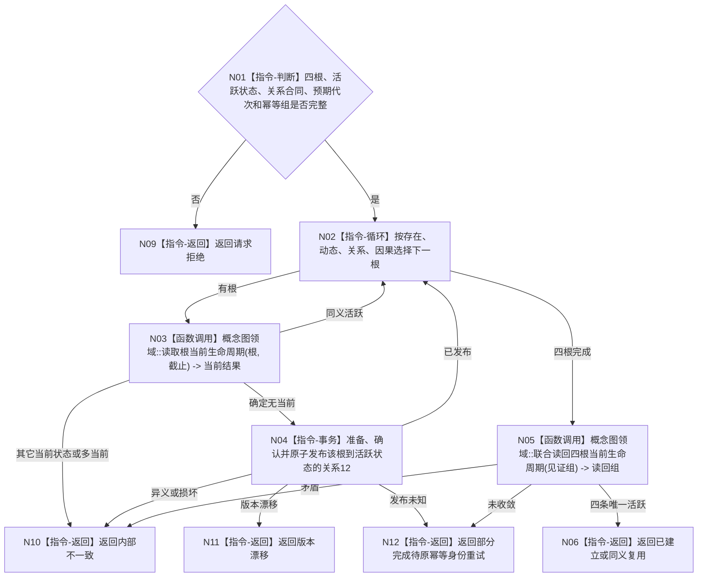

# BIZ-L4-001-03-05-04 确保四根永久活跃生命周期目标函数流程图 v0.1

更新时间：2026-08-03

> 状态：历史失效
>
> 替代：`BIZ-L3-001-03-09`
>
> 以下正文仅保留历史证据，不得作为规范、详细设计、计划或施工依据。

## 依据

```text
0050、7140；BIZ-L3-001-03-05
```

## 身份与边界

正式目标函数设计图。概念图领域逐根幂等确保恰一条指向固定活跃状态的当前关系12；每根关系是独立概念图写集，已发布关系不因后续根失败而回滚。

## 函数合同

```text
根函数：概念图业务服务::确保四根永久活跃生命周期
归属模块 / 文件 / 层级：概念图业务服务 / 海中鱼巣/领域/服务.概念活动.ixx / L4
现有或待新增：适配扩展；补齐逐根幂等、预期代次和发布未知收敛
完整签名：概念根生命周期确保结果 概念图业务服务::确保四根永久活跃生命周期(const 概念根生命周期确保请求& 请求)
参数：请求为只读借用；含四根对象完整身份、固定活跃状态身份、关系12合同版本、预期概念事实代次和逐根幂等身份
返回结果：不可变值式结果；含已建立、同义复用、部分完成待重试、请求拒绝、异义冲突、版本漂移、发布结果未知或内部不一致，以及四条关系12和逐根发布见证
被调函数流程图：无新增目标函数；关系12当前读取和单关系事务由概念图领域公开服务内部完成
父图：BIZ-L3-001-03-05
```

## 流程图



## 节点合同

| 节点 | 类型 | 输入 | 输出 | 事实读写 | 验证 |
| --- | --- | --- | --- | --- | --- |
| N03/N05 | 函数调用 | 根、截止或见证 | 当前关系12 | 只读概念图事实 | 零/一/多和目标状态 |
| N04 | 指令-事务 | 单根、活跃状态和幂等身份 | 单根发布见证 | 概念图领域单关系写集 | 发布未知只回读，不新建身份 |

## 关键边界

根生命周期初始化不能把普通概念迁移规则用于四根；发现根已处于冷却或退役不是普通可修复输入，而是内部不一致。
