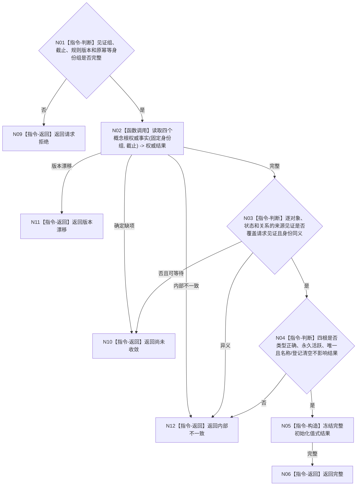

# BIZ-L4-001-03-05-05 联合读回四根与生命周期目标函数流程图 v0.1

更新时间：2026-08-03

## 依据

```text
0050、7140；BIZ-L3-001-03-05
```

## 身份与边界

正式目标函数设计图。按逐领域发布见证联合读回四个根对象、三个固定生命周期状态和四条当前关系12，形成启动层唯一可接受的完整初始化结果。

## 函数合同

```text
根函数：概念图初始化读取器::联合读回四根与生命周期
归属模块 / 文件 / 层级：概念图初始化读取 / 海中鱼巣/领域/读取.概念图初始化.ixx / L4
现有或待新增：待新增；复用BIZ-L4-001-03-05-01并绑定逐领域发布见证
完整签名：概念图初始化联合读回结果 概念图初始化读取器::联合读回四根与生命周期(const 概念图初始化联合读回请求& 请求) const
参数：请求为只读借用；含四根对象、三状态和四关系的发布见证组、事实截止向量、规则版本和原初始化幂等身份组
返回结果：不可变值式结果；含完整、尚未收敛、版本漂移或内部不一致，以及全部对象、关系、状态和来源见证
被调函数流程图：复用BIZ-L4-001-03-05-01读取四个概念根权威事实
父图：BIZ-L3-001-03-05
```

## 流程图



## 节点合同

| 节点 | 类型 | 输入 | 输出 | 事实读写 | 验证 |
| --- | --- | --- | --- | --- | --- |
| N02 | 函数调用 | 固定身份与截止 | 权威四根材料 | 只读正式事实 | 缺项、漂移和损坏 |
| N03—N06 | 指令 | 权威材料和见证组 | 完整初始化结果 | 无 | 见证覆盖、类型、唯一活跃和投影清空等价 |

## 关键边界

联合读回只确认已经发布的事实，不执行补写。名称、登记、索引或显示树缺失不得把完整结果降为失败，也不得把缺失根补造为成功。
