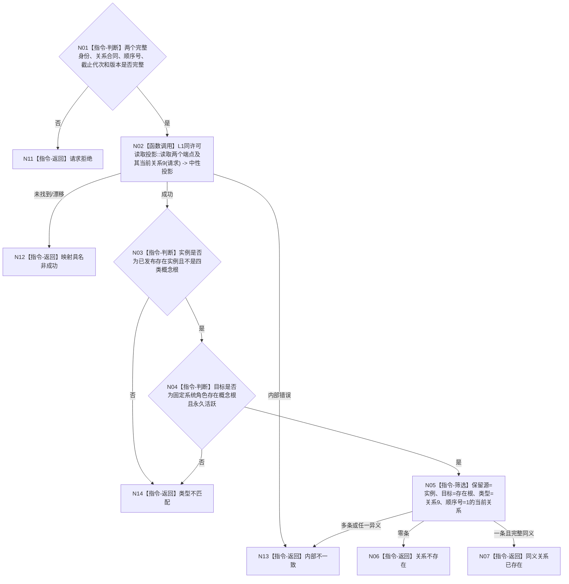

# BIZ-L4-001-03-06-01 读取存在实例与存在根支持事实目标函数流程图 v0.1

更新时间：2026-08-03

## 依据

```text
4010、7110、7140；BIZ-L3-001-03-06
当前 CAP-0042 可作候选，但根登记数组、名称和活动投影均不取得权威读取资格
```

## 身份与边界

正式目标函数设计图。在一个指定事实截止代次内，读取存在实例、固定存在概念根及二者之间当前关系9；只返回不可变权威投影，不通过名称、登记数组、缓存或多次独立许可拼接同代次事实。

## 函数合同

```text
根函数：概念图服务::读取存在实例与存在根支持事实
归属模块 / 文件 / 层级：概念图领域服务 / 海中鱼巣/领域/服务.概念图.ixx / L4
现有或待新增：适配扩展；复用节点、根角色和关系读取，改为4010同许可值式投影与7140业务复核
完整签名：存在根支持事实读取结果 概念图服务::读取存在实例与存在根支持事实(const 存在根支持事实读取请求& 请求) const
参数：请求为只读借用；含存在实例完整身份、固定存在根完整身份、关系9合同身份与版本、顺序号1、非零事实截止代次、7140规则版本和读取合同版本；隐式最新、名称或登记位置非法
返回结果：不可变值式结果；含已读取、请求拒绝、端点未找到、类型不匹配、版本漂移、关系不存在、同义关系已存在、异义重复或内部不一致，以及同次实例、存在根、当前关系9组和事实截止代次
被调函数流程图：4010同许可多结构读取投影属于L1通用能力，不在目标业务图重复
父图：BIZ-L3-001-03-06
```

## 流程图



## 节点合同

| 节点 | 类型 | 参数 / 输入绑定 | 结果 / 输出绑定 | 事实读写 | 后继条件 | 验证 |
| --- | --- | --- | --- | --- | --- | --- |
| N02 | 函数调用 | 两端点、关系合同和截止代次 | 单许可中性投影 | 只读同一内存已发布代次 | 成功或具名非成功 | 禁止多许可拼接、索引清空等价 |
| N03/N04 | 指令-判断 | 端点投影 | 业务端点资格 | 无 | 实例非根、目标为固定存在根 | 根作实例、名称伪根 |
| N05 | 指令-筛选 | 当前关系组 | 零条、一条同义或异义结构 | 无 | 7140关系9唯一键 | 重复、反向、错顺序号 |

## 关键边界

关系不存在是可继续创建的逻辑内结果，不是读取失败。索引未命中只有在4010读取合同证明覆盖当前代次和完整键空间时才能确认不存在；否则必须返回未裁决，不得从 SQL 或登记投影补判。
