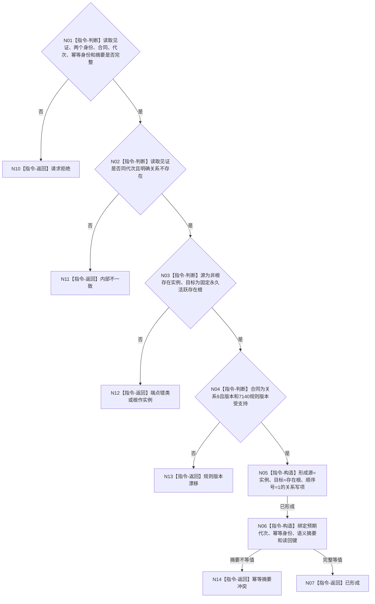

# BIZ-L4-001-03-06-02 形成实例支持概念关系9写入规格目标函数流程图 v0.1

更新时间：2026-08-03

## 依据

```text
4010、4040、7110、7140；BIZ-L3-001-03-06
```

## 身份与边界

正式目标函数设计图。把已复核的存在实例、固定存在根和关系9合同冻结为业务中性的不可变写项规格；不分配关系身份、不接触事务许可、不创建端点，也不发布事实。

## 函数合同

```text
根函数：形成实例支持概念关系9写入规格
归属模块 / 文件 / 层级：概念支持关系协议 / 海中鱼巣/领域/协议.概念支持关系.ixx / L4
现有或待新增：待新增；纯值规格形成器
完整签名：实例支持概念关系写入规格形成结果 形成实例支持概念关系9写入规格(const 实例支持概念关系写入规格形成请求& 请求) noexcept
参数：请求为只读借用；含同代次端点读取见证、存在实例与固定存在根完整身份、关系9合同身份与版本、顺序号1、预期事实代次、幂等身份与完整语义摘要、7140规则版本
返回结果：不可变值式结果；含已形成、请求拒绝、端点错类、根作实例、规则版本漂移、幂等摘要冲突或内部不一致，以及单条关系9中性写项和发布后读回键
被调函数流程图：无；字段复核、固定值赋值和摘要等值判断均为本函数内指令
父图：BIZ-L3-001-03-06
```

## 流程图



## 节点合同

| 节点 | 类型 | 参数 / 输入绑定 | 结果 / 输出绑定 | 事实读写 | 后继条件 | 验证 |
| --- | --- | --- | --- | --- | --- | --- |
| N02/N03 | 指令-判断 | 同代次读取见证与端点 | 创建资格 | 无 | 关系确定不存在、端点合法 | 关系竞态由事务最终复核 |
| N04/N05 | 指令-判断/构造 | 7140关系9合同 | 单条中性关系写项 | 无 | 类型、方向和顺序固定 | 反向、错角色、多写项 |
| N06 | 指令-构造 | 预期代次和幂等材料 | 完整事务输入规格 | 无 | 摘要覆盖完整语义 | 同键异义 |

## 关键边界

规格中不得含仓库对象、许可、锁、SQL表列、节点号、关系号或待执行回调。关系稳定身份由事务内的中性身份参与者产生；形成规格成功不证明关系已发布。

