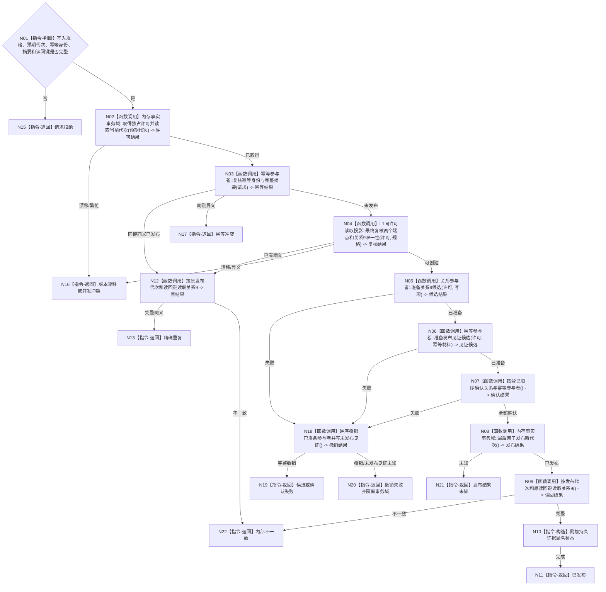

# BIZ-L4-001-03-06-03 发布实例支持概念关系9事务目标函数流程图 v0.1

更新时间：2026-08-03

## 依据

```text
4010、4040、7140；BIZ-L3-001-03-06
```

## 身份与边界

正式目标函数设计图。概念图领域在一个4040内存事实事务中最终复核端点、关系唯一性与幂等语义，准备并确认单条关系9，最后原子发布新代次并按原键读回；不修改端点对象，不把 SQL 或投影更新作为发布点。

## 函数合同

```text
根函数：概念图数据操作::发布实例支持概念关系9事务
归属模块 / 文件 / 层级：概念图领域数据操作 / 海中鱼巣/领域/数据操作.概念图.ixx / L4
现有或待新增：待新增；复用4040内存事实事务和L1关系参与者
完整签名：实例支持概念关系发布结果 概念图数据操作::发布实例支持概念关系9事务(const 实例支持概念关系发布请求& 请求)
参数：请求为只读借用；含已冻结关系9写入规格、预期事实代次、幂等身份、完整语义摘要、持久证据策略和发布后读回键；不得含外部锁、许可或可变仓库对象
返回结果：不可变值式结果；含已发布、精确重复、请求拒绝、版本漂移、幂等冲突、并发冲突、候选失败、确认失败、撤销失败、发布结果未知、持久证据具名状态或内部不一致，以及关系9完整材料和发布代次；仅已发布/精确重复返回可用关系事实
被调函数流程图：4040通用内存事实事务和L1关系参与者属于通用数据能力，不在目标业务图重复
父图：BIZ-L3-001-03-06
```

## 流程图



## 节点合同

| 节点 | 类型 | 参数 / 输入绑定 | 结果 / 输出绑定 | 事实读写 | 后继条件 | 验证 |
| --- | --- | --- | --- | --- | --- | --- |
| N02—N04 | 函数调用 | 预期代次、幂等材料和写入规格 | 独占许可内最终复核 | 只读同一当前代次 | 可创建/重复/冲突 | 同义并发、异义并发 |
| N05—N07 | 函数调用 | 关系写项和发布见证 | 已准备并确认参与者 | 仅事务候选可见 | 全部确认 | 每个故障点逆序撤销 |
| N18 | 函数调用 | 已准备参与者 | 完整撤销与未发布见证 | 当前事实不变 | 可安全释放或隔离 | 持久未发布见证失败 |
| N08 | 函数调用 | 全部已确认候选 | 新内存已发布代次 | 原子发布运行期事实 | 发布成功或未知 | 唯一线性化点 |
| N09—N13 | 函数调用/指令 | 原身份、幂等身份、代次和读回键 | 已发布或精确重复结果 | 只读内存权威 | 完整等义 | SQL/缓存不得补判 |

## 关键边界

关系9发布不创建或改写存在实例、存在概念根及其本域类型化记录。发布后投影失效/重建和持久证据追写属于后验；失败不得撤销或否认已发布关系。发布结果未知只能用原幂等身份和发布见证收敛，禁止生成第二关系身份。
