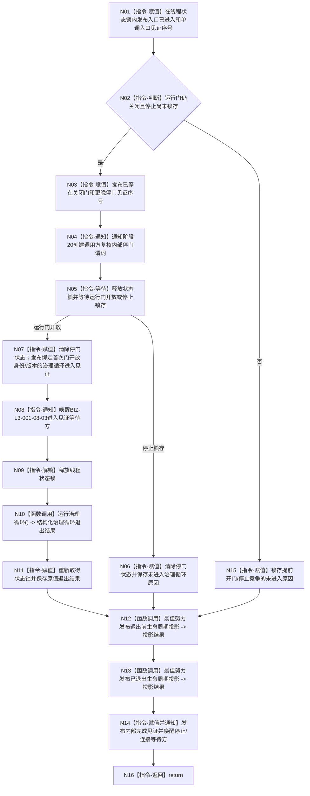

# BIZ-L4-001-03-11-01 执行自我线程入口正文目标函数流程图 v0.1

更新时间：2026-08-27

## 依据

```text
0050、8100、8110、8120 v0.10；BIZ-L3-001-03-11；BIZ-L2-001-08；BIZ-L3-001-08-03；BIZ-L1-T02 v0.6
```

## 身份与边界

正式目标函数设计图。唯一根函数是自我物理线程的私有入口正文：先形成内部进入和关闭门停驻见证；门开放后形成治理循环进入见证并调用唯一 `运行治理循环()`；停止或循环退出后保存结构化退出结果、发布生命周期旁路并形成内部完成见证。门开放前绝不冻结治理邮箱。

## 函数合同

```text
根函数：自我线程::执行线程入口正文
归属模块 / 文件 / 目标分解深度：自我线程唯一租约 / 海中鱼巣/线程/创建.自我线程.ixx / BIZ-L4
现有或待新增：部分实现；HEAD已停门并在开放后调用治理循环，但没有循环进入见证，且局部退出结果被丢弃
完整签名：void 自我线程::执行线程入口正文()
参数：无显式参数；只访问本对象持有的门、停止锁存、邮箱、内部见证/结果槽和非owning生命周期端口
返回结果：void；返回前必须保存可读治理循环退出结果或明确未进入原因，并发布内部完成见证；外层 `线程入口() noexcept` 只负责捕获全部异常并锁存入口异常/完成
被调函数流程图：BIZ-L1-T02 自我线程::运行治理循环；生命周期投影为8110非权威旁路
```

## 流程图



## 节点合同

| 节点 | 类型 | 参数 / 输入绑定 | 结果 / 输出绑定 | 事实读写 | 后继条件 | 验证 |
| --- | --- | --- | --- | --- | --- | --- |
| N01—N04 | 指令 | 本对象候选状态 | 入口与关闭门停驻见证 | 只写线程内部协调槽 | 停门序号严格晚于入口序号 | 调度延迟、提前开门、停止竞争和创建方虚假唤醒 |
| N05—N09 | 等待 / 指令 | 关闭门、停止锁存和首次开放见证 | 未进入原因或治理循环进入见证 | 门开放前零治理邮箱冻结；进入见证只写内部槽 | 只有开放或停止可越过门；进入见证先于治理循环调用 | 虚假唤醒、开放/停止竞争、见证绑定和锁释放 |
| N10—N11 | 函数调用 / 指令 | 已取得治理消费资格 | 原值治理循环退出结果 | 领域读写只发生在BIZ-L1-T02具名根内；本函数只保存结果 | 不丢弃退出结果 | 正常邮箱停止、结构化领域终止和异常边界 |
| N12—N16 | 函数调用 / 指令 | 未进入原因或循环退出结果 | 非权威投影尝试和内部完成见证 | 生命周期函数不裁决完成；完成见证内部发布 | 完成见证后不再调用外部端口，才允许join | 投影失败、完成见证、连接和外层异常捕获 |

## 关键边界

- 阶段20只消费N01—N05形成的入口/停门见证；BIZ-L2-001-08只消费N07—N08形成的治理循环进入见证。两类见证必须分账，均不能由8110投影替代。
- 门开放前不得调用治理邮箱冻结、批次路由或任何领域入口。门开放时邮箱可以已有未消费消息；N07证明消费资格，不证明空闲等待或任何消息已经处理。
- `运行治理循环()` 的结构化退出结果不得继续以局部变量丢弃。线程入口只保存结果和完成见证，不把线程退出直接解释为需求、任务或结算结论。
- 外层 `线程入口() noexcept` 仍是异常边界：正文异常时锁存入口异常和完成，唤醒阶段20/停止等待方；不得伪造停门、开门或循环进入成功。

## 冻结发布源码对照（提交 `745ef2ae`）

- `执行线程入口正文()` 已实现入口见证、关闭门停驻、开放/停止条件等待、开放后调用 `运行治理循环()`、8110退出投影和完成通知。
- 当前缺少门身份/版本、治理循环进入见证及通知；`const auto 退出结果` 随即 `(void)退出结果`，没有保存可读退出材料。
- `线程入口() noexcept` 已调用本正文并捕获全部异常，异常时原子锁存入口异常和完成；该薄wrapper不另建第二BIZ流程身份。
- 旧目标图“门开放后只锁存停止、治理循环未接线”与HEAD矛盾，现已退出。
