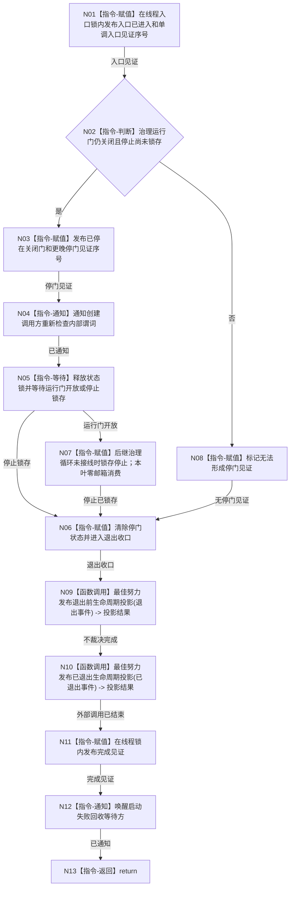

# BIZ-L4-001-03-11-01 自我线程进入并停在治理运行门目标函数流程图 v0.1

更新时间：2026-08-14

## 依据

```text
8100、8110、8120 v0.10；BIZ-L3-001-03-11
```

## 身份与边界

正式目标函数设计图。唯一根函数是已创建线程的入口正文；它只形成内部进入、停门和完成见证，在运行门开放前绝不读取或冻结治理邮箱。

## 函数合同

```text
根函数：自我线程::线程入口
归属模块 / 文件 / 目标分解深度：自我线程唯一租约 / 海中鱼巣/线程/创建.自我线程.ixx / BIZ-L4
现有或待新增：待新增；类私有、非导出
完整签名：void 自我线程::线程入口() noexcept
参数：无显式参数；只访问本对象持有的关闭门、停止锁存、见证槽和非 owning 生命周期端口
返回结果：void；退出前必须发布内部完成见证，生命周期投影不决定该见证
被调函数流程图：无；治理循环由后继独立设计
```

## 流程图



## 节点合同

| 节点 | 类型 | 参数 / 输入绑定 | 结果 / 输出绑定 | 事实读写 | 后继条件 | 验证 |
| --- | --- | --- | --- | --- | --- | --- |
| N01—N04 | 指令 | 本对象候选状态 | 入口与停门见证 | 只写线程内部门状态 | 停门序号严格晚于入口序号 | 调度延迟、停止竞争、门误开 |
| N05—N08 | 指令 | 关闭门、停止锁存 | 唤醒分支 | 等待期间释放锁；零治理邮箱读取 | 仅两个谓词可唤醒 | 虚假唤醒、停止唤醒、误开放 |
| N09—N13 | 函数调用 / 指令 | 退出原因 | 值式投影尝试和内部完成见证 | 生命周期消息非权威且均在完成见证前结束；完成见证内部发布 | 完成见证后线程不再调用外部端口，才允许 join | 发布端口失败、完成见证先于 join |

## 关键边界

- 本函数不得调用 `等待并冻结下一批` 或任何治理领域入口；治理邮箱消费数保持零。
- 生命周期函数不得在持有状态锁时调用。投影失败不改变进入、停门或完成见证。
- `线程入口() noexcept` 外壳捕获正文全部异常，以原子异常锁存和原子完成见证唤醒创建方；异常不得逃逸为 `std::terminate`，也不得伪造停门见证。
- 运行门开放分支当前只作防误开放收口；正式开放和治理循环必须由 BIZ-L2-001-08 及后继计划原位接入，不能在本叶偷跑。
