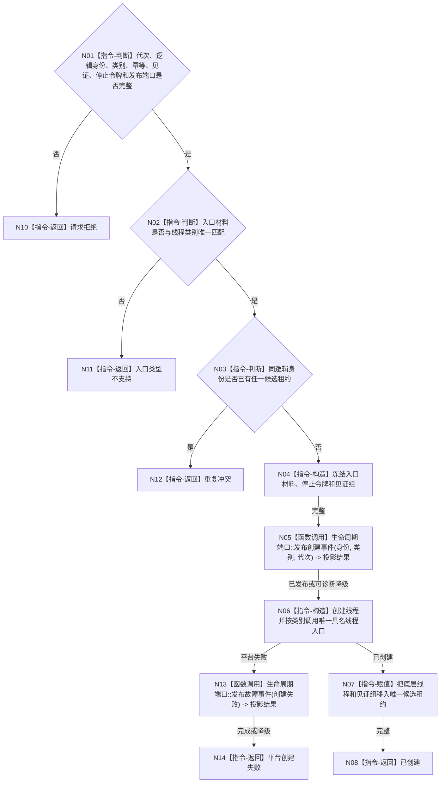

# BIZ-L4-001-04-00-01 创建支持线程候选目标函数流程图 v0.1

更新时间：2026-08-03

## 依据

```text
0050、8110、8120；BIZ-L2-001-04；BIZ-L3-001-04-01—03
当前事件日志线程和缓存统计线程具有重复的 std::thread 启动壳，适合收束为共享生命周期基座
```

## 身份与边界

正式目标函数设计图。它只创建一个强类型支持线程候选并返回唯一移动租约；具体线程入口仍由事件日志、缓存统计或持久证据工作者各自拥有。生命周期投影失败只诊断降级，不阻断业务启动。

## 函数合同

```text
根函数：创建支持线程候选
归属模块 / 文件 / 层级：支持线程启动协调 / 海中鱼巣/启动.线程组协调.ixx / L4
现有或待新增：待新增；收束事件日志、缓存统计和持久证据工作者的重复创建骨架
完整签名：支持线程候选创建结果 创建支持线程候选(const 支持线程候选创建请求& 请求)
参数：请求为只读借用；含运行代次、唯一线程逻辑身份、强类型线程类别、启动幂等身份、进入与完成见证身份、停止令牌、生命周期发布端口及三选一完整入口材料；函数返回前把入口材料复制或移动到候选线程独占区
返回结果：移动值式结果；含已创建、请求拒绝、入口类型不支持、重复冲突、平台创建失败或内部不一致，以及唯一支持线程候选租约和见证身份
被调函数流程图：BIZ-L4-001-04-01-01、BIZ-L4-001-04-02-01、BIZ-L4-001-04-03-02三选一；8110生命周期消息为共享旁路合同
父图：BIZ-L3-001-04-01、BIZ-L3-001-04-02、BIZ-L3-001-04-03
```

## 流程图



## 节点合同

| 节点 | 类型 | 参数 / 输入绑定 | 结果 / 输出绑定 | 事实读写 | 后继条件 | 验证 |
| --- | --- | --- | --- | --- | --- | --- |
| N02/N03 | 指令-判断 | 类别、入口材料和逻辑身份 | 唯一入口准入 | 只读协调器本地状态 | 一类一入口、一个候选 | 错配variant、并发双启动 |
| N05/N13 | 函数调用 | 8110生命周期材料 | 投影结果 | 只写线程投影输入 | 可诊断降级 | 控制面板不可用不阻断创建 |
| N06/N07 | 指令 | 独占入口材料 | 唯一移动租约 | 只改线程资源 | 创建成功 | 禁止detach和裸所有权 |

## 关键边界

共享的是平台线程生命周期，不是三类材料的业务解释。入口 variant 不接受任意回调、字符串角色或裸 `void*`；新增支持线程类别必须先登记具名入口合同。候选租约只能交给成功租约组或 BIZ-L4-001-04-00-03。
