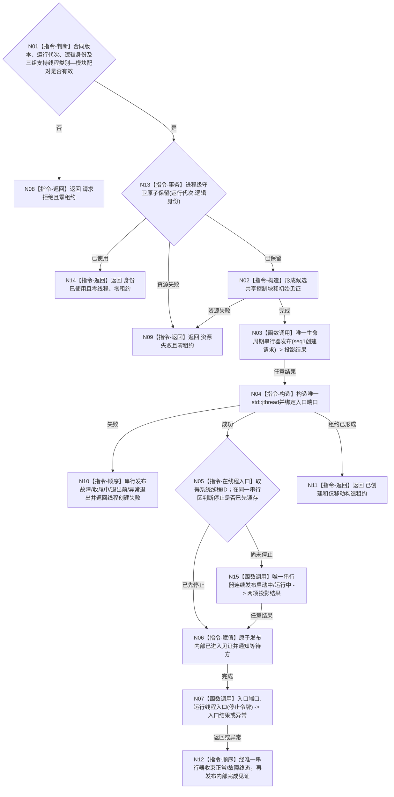

# BIZ-L4-001-04-00-01 创建支持线程候选目标函数流程图 v0.2

更新时间：2026-08-27

## 依据

```text
0050、8110；THREAD-LIFECYCLE-PROJECTION-SERVICE v0.1；
SUPPORT-THREAD-CANDIDATE-LIFECYCLE 详细设计 v0.1
```

## 身份与边界

正式目标函数设计图。v0.2 替代 v0.1 的未冻结强类型 `variant`：共享基础只接收一个具名入口端口，不预造事件日志、缓存统计或持久证据 DTO。生命周期消息是最佳努力诊断投影，物理线程和内部见证由唯一移动租约拥有。

## 函数合同

```text
根函数：创建支持线程候选
归属模块 / 文件 / 层级：海中鱼巣.线程.候选.支持线程 / 海中鱼巣/线程/候选.支持线程.ixx / BIZ-L4
现有或待新增：已实现并登记工程；EVENT provider 已真实消费三个公开入口，旧事件日志/缓存线程壳未复用
完整签名：支持线程候选创建结果 创建支持线程候选(const 支持线程候选创建请求& 请求, 支持线程入口端口& 入口端口, 线程生命周期发布端口& 生命周期端口) noexcept
参数：请求为只读值；两个端口为借用且生命周期覆盖返回租约
返回结果：已创建、请求拒绝、身份已使用、线程创建失败、资源失败或内部不一致；可选仅移动构造候选租约；发布非接受累计值从租约见证读取
被调函数流程图：无；生命周期 provider 是已发布叶级公开能力
```

## 流程图



## 节点合同

| 节点 | 类型 | 参数 / 输入绑定 | 结果 / 输出绑定 | 事实读写 | 后继条件 | 验证 |
| --- | --- | --- | --- | --- | --- | --- |
| N01/N13/N14/N02 | 指令 | 创建请求 | 准入、身份墓碑、控制块 | 只写进程级身份守卫与候选私有状态 | 全部前置有效且身份首次使用 | 坏版本/配对、并发重复、历史重用 |
| N03/N05/N15 | 函数调用/指令 | 生命周期请求、停止锁存 | 诊断投影结果 | 只写8110投影；非接受只累计到租约见证 | 不决定物理结果；早停跳过启动投影 | provider拒绝/暂不可用、创建后立即回收 |
| N04/N11 | 指令 | 控制块、入口借用 | 唯一移动租约 | 只拥有物理线程 | 构造成功才返回租约 | 线程真实创建、单owner |
| N06/N07/N12 | 指令/函数调用 | stop_token、入口端口 | 进入/完成见证 | 只写候选内部见证；终态序号单一分配 | 包装捕获异常并复核入口结果 | 真实进入、抛出/坏枚举/提前返回、终态先于完成见证 |

## 关键边界

```text
生命周期投影 != 物理线程租约权威
共享候选基础 != 具体支持线程入口所有者
创建返回后入口线程可并发运行；调用方必须保持两个借用端口存活
同一运行代次逻辑身份最多保留一次；创建失败后的重试使用新身份
创建成功后线程包装唯一发布启动与终态链；创建方只处理物理线程尚未形成的故障链
创建结果不复制会过期的投影降级快照；调用方从租约见证读取累计未接受次数
线程创建失败零租约泄漏；禁止 detach
```

## 当前代码对应（HEAD `b9abf5a3`）

- `海中鱼巣/线程/支持线程候选.数据.h` 与 `海中鱼巣/线程/候选.支持线程.ixx` 已实现本入口并受工程登记；结果提交为 `fd1c8852`。
- HEAD 的 EVENT provider 已真实调用本函数，并把唯一候选租约继续交给进入等待或失败回收；CACHE、持久叶和父支持组仍未调用。
- 本批不重跑 SUPPORT 专项，只确认已发布入口、EVENT 模块内消费边和零其它生产装配。
