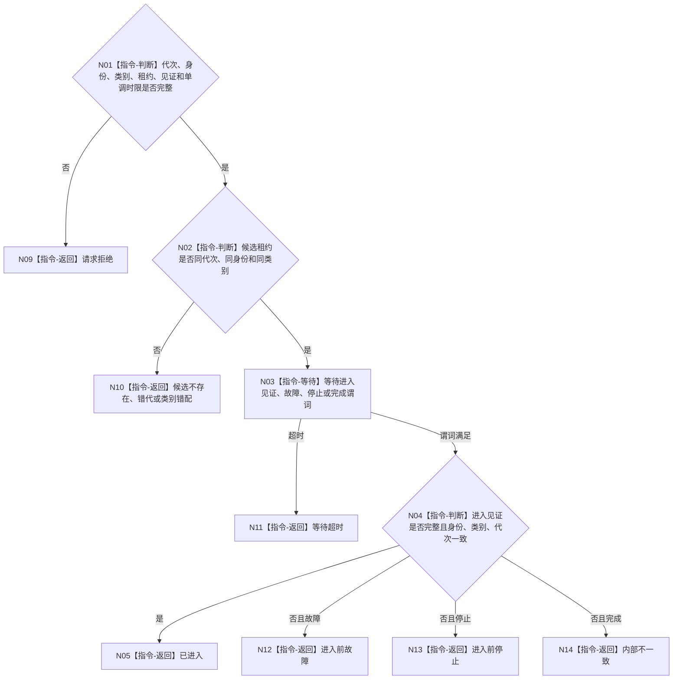

# BIZ-L4-001-04-00-02 等待支持线程进入见证目标函数流程图 v0.1

更新时间：2026-08-03

## 依据

```text
8110、8120；BIZ-L3-001-04-01—03
```

## 身份与边界

正式目标函数设计图。按单调时限等待指定支持线程发布“已进入消费等待态”见证；线程对象已创建、系统线程ID已出现或日志文本已输出均不能替代进入见证。

## 函数合同

```text
根函数：等待支持线程进入见证
归属模块 / 文件 / 层级：支持线程启动协调 / 海中鱼巣/启动.线程组协调.ixx / L4
现有或待新增：待新增；复用条件变量，统一具名见证和单调时限
完整签名：支持线程进入等待结果 等待支持线程进入见证(const 支持线程进入等待请求& 请求)
参数：请求为只读借用；含运行代次、逻辑身份、线程类别、候选租约身份、预期进入见证身份和非零单调最长等待
返回结果：不可变值式结果；含已进入、请求拒绝、候选不存在、错代、类别错配、进入前故障、进入前停止、等待超时或内部不一致，以及进入见证和线程投影
被调函数流程图：无；条件等待和见证复核均为本函数内指令
父图：BIZ-L3-001-04-01、BIZ-L3-001-04-02、BIZ-L3-001-04-03
```

## 流程图



## 节点合同

| 节点 | 类型 | 参数 / 输入绑定 | 结果 / 输出绑定 | 事实读写 | 后继条件 | 验证 |
| --- | --- | --- | --- | --- | --- | --- |
| N02 | 指令-判断 | 租约与请求身份 | 候选一致性 | 无 | 同候选 | 旧租约和类别错配 |
| N03 | 指令-等待 | 单调时限和终止谓词 | 唤醒原因 | 无 | 进入/终止/超时 | 伪唤醒、墙钟跳变 |
| N04 | 指令-判断 | 进入见证 | 结构化进入结果 | 只读见证 | 三身份一致 | 创建不替代进入 |

## 关键边界

进入见证只证明入口已经具备消费等待能力，不证明队列有材料、日志写入成功、缓存已重建或持久证据已保存。超时必须把租约交给共享回收函数，不得分离线程。
