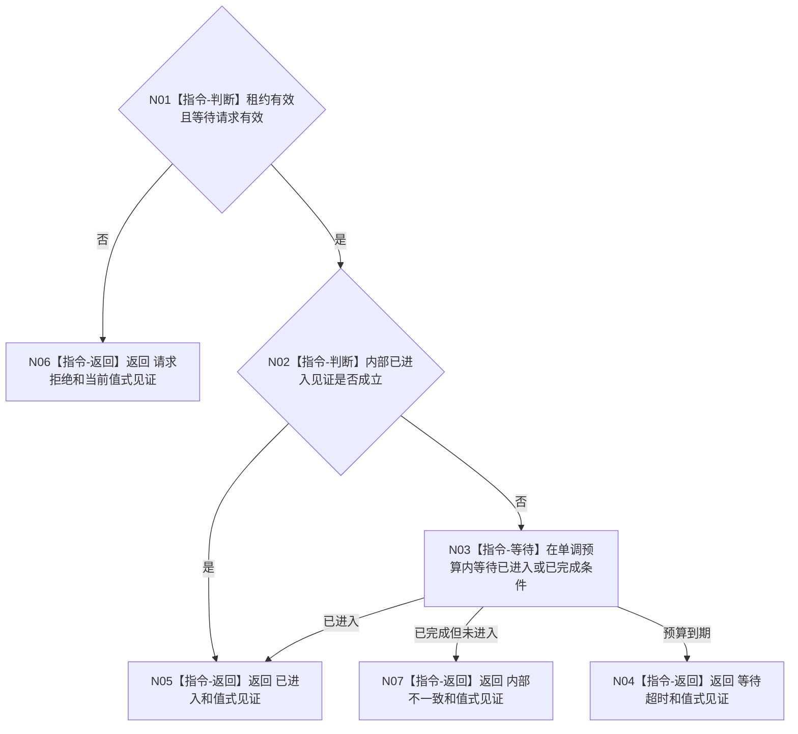

# BIZ-L4-001-04-00-02 等待支持线程进入见证目标函数流程图 v0.2

更新时间：2026-08-15

## 依据

```text
0050、8110；SUPPORT-THREAD-CANDIDATE-LIFECYCLE 详细设计 v0.1
```

## 身份与边界

正式目标函数设计图。只等待候选共享控制块中的内部进入/完成见证；不读取 8110 投影，不轮询日志或系统线程 ID。等待超时后候选租约仍由调用方拥有并必须回收。

## 函数合同

```text
根函数：等待支持线程进入见证
归属模块 / 文件 / 层级：海中鱼巣.线程.候选.支持线程 / 海中鱼巣/线程/候选.支持线程.ixx / BIZ-L4
现有或待新增：待新增共享基础
完整签名：支持线程进入等待结果 等待支持线程进入见证(const 支持线程候选租约& 候选租约, const 支持线程进入等待请求& 请求) noexcept
参数：租约只读借用；请求含合同版本和非零最大等待毫秒
返回结果：已进入、等待超时、请求拒绝或内部不一致，以及值式见证；正式生产路径不存在“已完成但未进入”成功形状
被调函数流程图：无
```

## 流程图



## 节点合同

| 节点 | 类型 | 参数 / 输入绑定 | 结果 / 输出绑定 | 事实读写 | 后继条件 | 验证 |
| --- | --- | --- | --- | --- | --- | --- |
| N01—N02 | 指令 | 租约、请求 | 准入和已有见证 | 只读候选状态 | 有效才等待 | 空租约、零预算 |
| N03 | 指令-等待 | 控制块条件变量 | 进入/完成/超时 | 无业务写入 | 任一条件 | 伪唤醒、并发完成；完成未进入只作防御 |
| N04—N07 | 指令-返回 | 当前见证 | 具名等待结果 | 返回值式副本 | 租约仍归调用方 | 超时后可回收 |

## 关键边界

```text
内部进入见证是物理启动证据；8110只作诊断投影
等待超时不消费、不销毁、不覆盖候选租约
最大等待是等待结果预算，不授权detach
线程包装固定先发布已进入再调用入口；完成未进入不是合法生产状态
```
