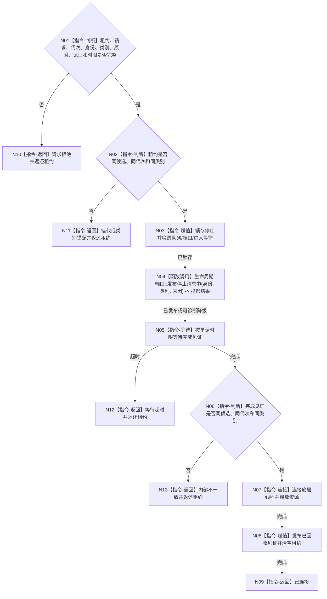

# BIZ-L4-001-04-00-03 停止并连接支持线程启动候选目标函数流程图 v0.1

更新时间：2026-08-03

## 依据

```text
8110、8120；BIZ-L3-001-04-01—03
```

## 身份与边界

正式目标函数设计图。仅回收未完成启动的支持线程候选；锁存停止、唤醒入口、等待完成见证后连接。它不清空已接受队列、不撤销业务事实，也不替代正式停机刷新链。

## 函数合同

```text
根函数：停止并连接支持线程启动候选
归属模块 / 文件 / 层级：支持线程启动协调 / 海中鱼巣/启动.线程组协调.ixx / L4
现有或待新增：待新增；统一支持线程失败候选回收
完整签名：支持线程候选回收结果 停止并连接支持线程启动候选(支持线程候选租约&& 候选租约, const 支持线程候选回收请求& 请求) noexcept
参数：候选租约为唯一移动所有权；请求为只读借用，含代次、身份、类别、回收原因、完成见证身份和非零单调最长等待
返回结果：移动值式结果；含已连接、请求拒绝、错代、类别错配、等待超时或内部不一致；未连接时必须返还唯一未回收租约
被调函数流程图：无；停止锁存、条件唤醒、完成等待和join均为本函数内指令
父图：BIZ-L3-001-04-01、BIZ-L3-001-04-02、BIZ-L3-001-04-03
```

## 流程图



## 节点合同

| 节点 | 类型 | 参数 / 输入绑定 | 结果 / 输出绑定 | 事实读写 | 后继条件 | 验证 |
| --- | --- | --- | --- | --- | --- | --- |
| N02/N03 | 指令 | 唯一租约和回收请求 | 停止锁存 | 只改线程运行状态 | 同候选 | 错代和错类 |
| N04 | 函数调用 | 生命周期材料 | 投影结果 | 只写8110旁路 | 可诊断降级 | 投影失败不阻断回收 |
| N05—N08 | 指令 | 完成见证和租约 | 连接/未回收租约 | 释放线程资源 | 先完成后join | 禁止detach、双join、租约丢失 |

## 关键边界

如果等待超时，调用方必须保留返还租约并升级进程级故障，不能让租约析构触发无界等待。正式停机期间已接受材料的刷新、冻结和接管由 BIZ-L2-001-15 处理，不由本函数丢弃。
