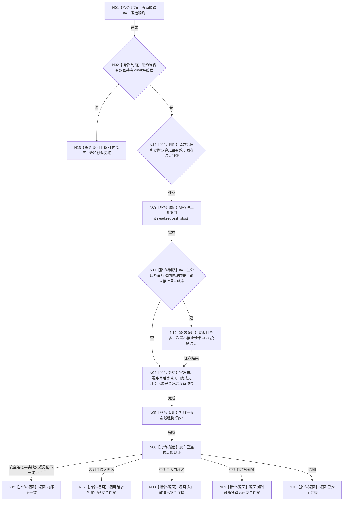

# BIZ-L4-001-04-00-03 停止并连接支持线程启动候选目标函数流程图 v0.2

更新时间：2026-08-27

## 依据

```text
0050、8110；SUPPORT-THREAD-CANDIDATE-LIFECYCLE 详细设计 v0.1
```

## 身份与边界

正式目标函数设计图。移动消费一个候选租约，固定请求停止、等待入口完成并 `join`。诊断预算到期后仍继续安全连接，不返还 joinable 租约，不 detach。

## 函数合同

```text
根函数：停止并连接支持线程启动候选
归属模块 / 文件 / 层级：海中鱼巣.线程.候选.支持线程 / 海中鱼巣/线程/候选.支持线程.ixx / BIZ-L4
现有或待新增：已实现并登记工程；EVENT 启动失败和 EVENT 租约显式/析构回收均真实调用
完整签名：支持线程候选回收结果 停止并连接支持线程启动候选(支持线程候选租约&& 候选租约, const 支持线程候选回收请求& 请求) noexcept
参数：租约移动输入；请求含合同版本和非零诊断等待毫秒
返回结果：已安全连接、超过诊断预算后已安全连接、入口故障已安全连接、请求拒绝但已安全连接或内部不一致，以及最终值式见证
被调函数流程图：无
```

## 流程图



## 节点合同

| 节点 | 类型 | 参数 / 输入绑定 | 结果 / 输出绑定 | 事实读写 | 后继条件 | 验证 |
| --- | --- | --- | --- | --- | --- | --- |
| N01/N02/N13/N14/N03 | 指令 | 移动租约、请求 | 独占所有权、准入分类、停止令牌 | 只写候选控制状态 | 空租约直接内部不一致；有效租约无论请求是否有效都安全收口 | 空/已移动租约、坏请求 |
| N11/N12 | 指令/函数调用 | 已锁存停止、物理当前态 | 停止请求中投影结果或零操作 | 仅可进入时写8110投影并分配序号；已停止/终态零发布零计数 | 任意结果均继续 | 与入口故障并发、终态后回收、零重复停止链 |
| N04—N06 | 指令 | 完成条件、线程 | 完成/连接见证 | 只释放物理线程资源 | 终态发布尝试、内部完成见证和join均完成才返回 | 预算内外、入口故障 |
| N15/N07—N10 | 指令-返回 | 最终见证、请求有效性、入口结果、预算 | 具名回收结果 | 无业务事实 | 按固定优先级且零joinable租约 | 多条件并存、结果与见证一致 |

## 关键边界

```text
诊断预算不是硬取消时限
请求无效也不能把已移动的joinable租约退回或遗失
结果优先级：内部不一致 > 请求拒绝但已安全连接 > 入口故障已安全连接 > 超预算已安全连接 > 已安全连接
入口故障只形成支持线程候选结果和8110异常投影，不形成业务失败
request_stop后仅在物理态仍可进入停止时立即、至多一次发布停止请求中；入口包装唯一收束后继正常或故障终态
若包装已完成终态，回收停止投影守卫零操作，不消费序号或未接受计数
零detach，返回前必须已join
```

## 当前代码对应（HEAD `b9abf5a3`）

- SUPPORT 模块已实现本入口；请求有效与否均移动消费唯一租约、锁存停止并在返回前 join，诊断预算只影响结果分类。
- EVENT provider 的进入非成功路径、EVENT 租约右值 `停止并连接` 及析构 fallback 均调用本函数；裸 SUPPORT 租约未向 EVENT 调用者暴露。
- 本批未重跑预算超时、入口故障或坏请求动态专项，不以静态调用边替代安全连接验收。
