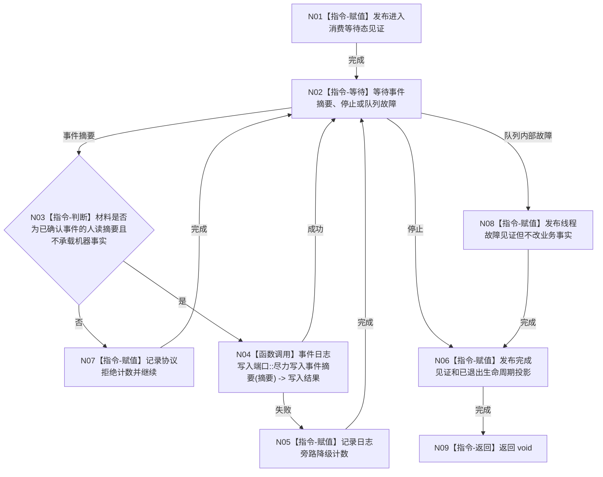

# BIZ-L4-001-04-01-01 运行事件日志线程入口目标函数流程图 v0.1

更新时间：2026-08-03

## 依据

```text
0050、8110、日志系统规范；BIZ-L3-001-04-01
旧鱼巣外设持久化与显示流程仅吸收“日志旁路不写世界事实”节奏
```

## 身份与边界

正式目标函数设计图。线程只消费已经由正式结构确认后形成的人读事件摘要，尽力写入事件日志出口；日志失败记录独立降级，不改变业务结果、线程继续条件或权威事实。

## 函数合同

```text
根函数：事件日志线程::运行线程入口
归属模块 / 文件 / 层级：事件日志线程 / 海中鱼巣/线程/事件日志线程.ixx / L4
现有或待新增：目标替换；复用现行循环壳，退出yield空转和bool模拟失败
完整签名：void 事件日志线程::运行线程入口(事件日志线程入口材料 入口材料) noexcept
参数：入口材料按值由线程独占；含运行代次、逻辑身份、事件摘要有界队列借用租约、事件日志写入端口、停止令牌、进入/完成见证和生命周期端口；全部借用覆盖线程租约
返回结果：void；进入、降级、故障和完成通过具名线程见证及8110投影观察；日志写入结果不进入业务返回
被调函数流程图：事件日志写入端口的施工实现不属于机器目标业务图；共享候选创建/等待/回收见BIZ-L4-001-04-00-01—03
父图：BIZ-L3-001-04-01
```

## 流程图



## 节点合同

| 节点 | 类型 | 参数 / 输入绑定 | 结果 / 输出绑定 | 事实读写 | 后继条件 | 验证 |
| --- | --- | --- | --- | --- | --- | --- |
| N02/N03 | 指令 | 有界队列与摘要 | 合法摘要或协议拒绝 | 只消费旁路材料 | 等待/停止 | 假机器事实、错误类别 |
| N04/N05 | 函数调用/指令 | 人读摘要 | 写入/降级计数 | 只写日志出口 | 始终继续 | 写失败注入不改业务结果 |
| N06/N08 | 指令 | 停止或故障 | 完成/故障见证 | 只写线程投影 | 入口收束 | 无异常越过线程边界 |

## 关键边界

日志队列不是可靠业务消息队列；若材料必须驱动恢复、任务完成或业务继续，就必须进入正式结构化证据服务。停止阶段是否排空已接受摘要由 BIZ-L2-001-15 决定，本入口不因日志失败无限重试。

