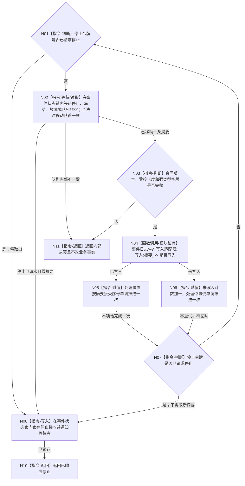

# BIZ-L4-001-04-01-01 运行事件日志线程入口目标函数流程图 v0.2

更新时间：2026-08-27

## 依据

```text
0050、8110、日志系统规范；BIZ-L3-001-04-01 v0.2；
BIZ-L2-001-15 v0.2；BIZ-L3-001-15-01—03 v0.2；BIZ-L4-001-15-01-01—02、03-01—02 v0.2
```

## 身份与边界

正式目标函数设计图。事件日志线程入口只从专属有界队列取得强类型人读事件摘要，并经模块私有生产写入适配器机械调用现行日志出口；日志不是机器事实、恢复输入或业务成功条件。正常停止在本入口收到停止令牌前已由 BIZ-L2-001-15 v0.2 处理到接受截止；降级停止则先形成同截止未取出快照和具名材料丢失状态。收到停止后不得再从队列移出新摘要，仅允许已经移出的当前摘要恰完成一次写入尝试。

## 函数合同

```text
根函数：事件日志线程入口::运行线程入口
归属模块 / 文件 / 层级：海中鱼巣.线程.运行.事件日志线程 / 海中鱼巣/线程/运行.事件日志线程.ixx / BIZ-L4
现有或待新增：已实现为 EVENT 模块私有 `final` 入口并由 `启动事件日志线程` 唯一构造；旧事件线程循环壳与通用无锁运行消息队列未复用
完整签名：支持线程入口结果 事件日志线程入口::运行线程入口(std::stop_token 停止令牌)
参数：停止令牌按值传入且只读观察；事件日志状态与生产写入适配器由入口对象构造时借用，并与入口一起由同一 `事件日志线程租约` 唯一持有；入口不持有8110端口
返回结果：值式支持线程入口结果；正常停止返回状态“已响应停止”和具名原因键，队列协议/内部状态矛盾返回“内部故障”和具名原因键；单条日志已写入/未写入只更新入口私有诊断计数，不改变返回状态、业务结果或机器事实
被调函数流程图：无；当前等待、队首移动和停止锁存在本函数内以状态锁具体指令完成，日志写入只调用模块私有 `事件日志生产写入适配器::写入`，均不形成公开 ABI
父图：BIZ-L3-001-04-01 v0.2
```

## 流程图



## 节点合同

| 节点 | 类型 | 参数 / 输入绑定 | 结果 / 输出绑定 | 事实读写 | 后继条件 | 验证 |
| --- | --- | --- | --- | --- | --- | --- |
| N01/N07 | 指令-判断 | 根参数 `停止令牌` | 继续等待或进入停止锁存 | 只读停止状态 | stop 后零新取出 | 等待前停止、取出后并发停止 |
| N02 | 本函数内指令 | `停止令牌`、事件状态和条件变量 | 可选当前项或停止 / 冻结 / 故障分流 | 锁内 FIFO 移动至多一项；停止竞争时先锁存停止接收再零移出；不调用日志 | 未停止且未冻结才可移出；停止分支零移出 | 伪唤醒、满队列、停止竞争、接受序号单调 |
| N03 | 指令-判断 | 已移动 `事件日志摘要` | 合法摘要或内部故障 | 不查询业务服务，不推导摘要真伪 | 仅校验结构形状 | 坏版本、超长文本、伪“已确认机器事实”字段不得存在 |
| N04 | 函数调用-模块私有 | 摘要 -> `事件日志生产写入适配器::写入` | `bool` -> 是否写入 | 适配器机械调用现行事件日志出口 | 恰调用一次 | 出口不可用、写入失败、异常隔离 |
| N05/N06 | 指令-赋值 | 是否写入、摘要接受序号 | 处理位置和私有诊断计数 | 只写非权威线程私有进度 | 两分支都不重试、不回队 | 写失败不改变业务结果和线程继续条件 |
| N08 | 本函数内指令 | 入口观察到的停止或取出冻结 | 已停止接收的状态与通知 | 锁内关闭新提交、保留全部未取出摘要并唤醒等待者 | 锁存后正常返回 | 已由收口方关闭、生产者并发提交、剩余摘要守恒 |
| N10/N11 | 指令-返回 | 队列已停止或内部矛盾 | `支持线程入口结果` | 不发布8110生命周期；由 SUPPORT 包装统一收束 | 唯一返回 | 正常已刷新停止、降级快照接管、内部故障 |

## 关键边界

```text
事件日志摘要只含合同版本、运行代次、摘要身份、发生时间、所属模块、入口/操作、诊断分类、可选稳定编码、可选来源请求摘要和受控长度人读摘要；不得携带“已确认机器事实”布尔或业务载荷。
队列为事件日志专属有界 MPSC/单消费者结构；锁内 FIFO 和接受序号单调，满时拒绝新项、不驱逐，停止后拒绝新提交并唤醒；无停止哨兵。
队列锁内不得调用日志、DATA、8110或任意回调。写失败零重试、零回队，不改变业务返回、权威事实或线程继续条件。
队列状态、入口和生产写入适配器只在 EVENT 模块内部可见；生产者只能经租约公开 `提交` 交付摘要，不得取得队列、入口、适配器或日志出口。
正常收口由 BIZ-L2-001-15 v0.2 在请求停止前先取得接受截止并处理至该截止；若超时或故障，未取出摘要先形成同截止队列快照，再由上层裁决专属 owner、具名日志丢失降级或保留租约。不存在通用接管端口。
入口收到 stop 后必须幂等锁存队列停止接收，再不得移出新摘要；停止前已经移出的当前摘要允许恰完成一次，未移出摘要保留在队列或既有快照中，禁止静默删除。
入口不发布进入/完成/8110生命周期，不返回第二份租约；这些统一由 SUPPORT 包装与唯一租约承接。
```

## 当前代码对应（HEAD `b9abf5a3`）

- 模块私有 `事件日志线程入口 final : 支持线程入口端口` 与本根函数已实现；入口先注册覆盖等待期的 `stop_callback`，随后按锁内等待/移动、锁外单次写入、锁内连续位置复核循环运行。
- stop 或取出冻结优先于新取出；已移出项最多完成一次，日志写入失败只增加非权威计数并推进完成位置。该语义与本图一致，但当前源码使用本函数内锁指令而非旧图虚构的三个队列公开/私有方法，图中节点已据此校正。
- 本入口只由已实现的 EVENT provider 构造；EVENT 仍无生产调用者，故本叶实现存在不证明支持线程组、阶段15或普通应用接线完成。
