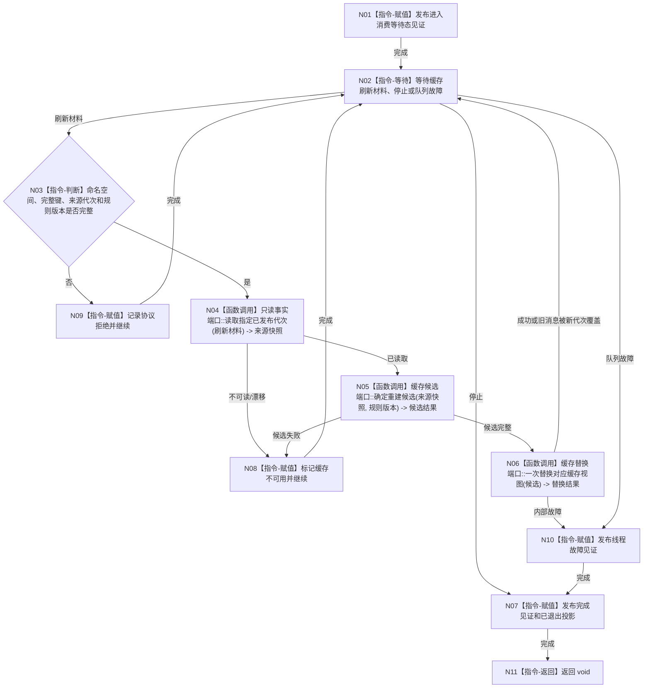

# BIZ-L4-001-04-02-01 运行缓存统计线程入口目标函数流程图 v0.1

更新时间：2026-08-03

## 依据

```text
0050、4060、8110；BIZ-L3-001-04-02
```

## 身份与边界

正式目标函数设计图。线程只按已发布代次证据失效、重建或更新非权威缓存与统计投影；候选重建失败丢弃候选并回源，不写业务事实或 SQL。

## 函数合同

```text
根函数：缓存统计线程::运行线程入口
归属模块 / 文件 / 层级：缓存统计线程 / 海中鱼巣/线程/缓存统计线程.ixx / L4
现有或待新增：目标替换；复用现行线程壳，补齐4060代次材料和确定重建
完整签名：void 缓存统计线程::运行线程入口(缓存统计线程入口材料 入口材料) noexcept
参数：入口材料按值由线程独占；含运行代次、逻辑身份、缓存刷新有界队列借用租约、只读已发布事实端口、缓存候选构造与替换端口、规则版本、停止令牌和见证组；全部借用覆盖线程租约
返回结果：void；进入、降级、故障和完成通过线程见证观察；缓存结果不进入业务事实
被调函数流程图：具体命名空间重建算法按其领域能力单独设计；共享生命周期见BIZ-L4-001-04-00-01—03
父图：BIZ-L3-001-04-02
```

## 流程图



## 节点合同

| 节点 | 类型 | 参数 / 输入绑定 | 结果 / 输出绑定 | 事实读写 | 后继条件 | 验证 |
| --- | --- | --- | --- | --- | --- | --- |
| N03/N04 | 指令/函数调用 | 4060刷新材料 | 指定代次来源快照 | 只读内存权威 | 来源完整 | SQL不得回源 |
| N05/N06 | 函数调用 | 来源快照和规则版本 | 候选及一次替换 | 只写非权威缓存 | 候选完整 | 相同输入等价、半候选不可见 |
| N08—N10 | 指令 | 漂移/失败/故障 | 不可用或线程故障见证 | 不写业务事实 | 继续或停止 | 清空缓存后业务等价 |

## 关键边界

缓存命中、统计排序和刷新成功不能改变身份、关系、因果、需求权重或任务状态。旧代次刷新迟到时只丢弃或由新代次覆盖，不允许把缓存内容写回权威结构。
