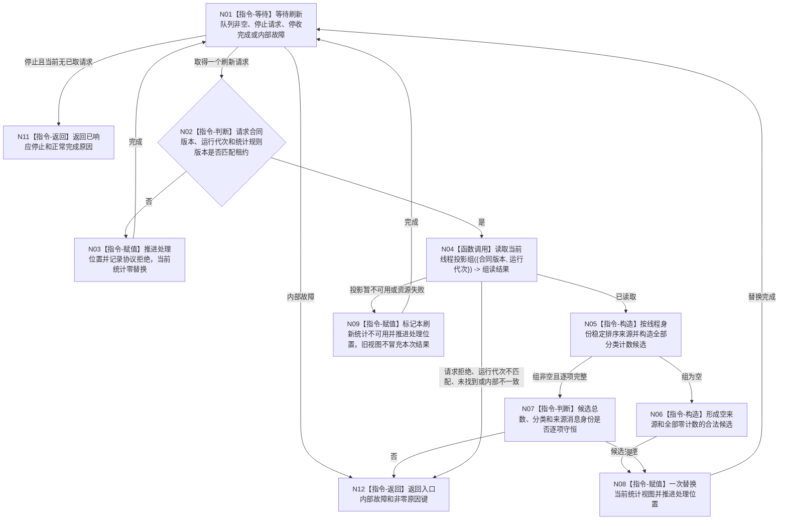

# BIZ-L4-001-04-02-01 运行缓存统计线程入口目标函数流程图 v0.2

更新时间：2026-08-15

## 依据

```text
0050、4060、8110；BIZ-L3-001-04-02 v0.2；
CACHE-STATISTICS-THREAD-PRODUCTION-START v0.1；SUPPORT 最终入口端口 ABI。
```

## 身份与边界

正式目标函数设计图。模块私有入口按显式刷新请求读取当前运行代次完整线程投影组，构造确定统计候选并一次替换当前统计视图。统计视图和刷新位置均为可丢弃运行投影，不写 DATA 或业务事实。

## 函数合同

```text
根函数：缓存统计线程入口::运行线程入口
归属模块 / 文件 / 层级：海中鱼巣.线程.运行.缓存统计线程 / 海中鱼巣/线程/运行.缓存统计线程.ixx / BIZ-L4
现有或待新增：待新增模块私有 final override
完整签名：支持线程入口结果 缓存统计线程入口::运行线程入口(std::stop_token 停止令牌) override
参数：停止令牌按值，由 SUPPORT 传入；入口私有拥有体借用 const 线程生命周期投影读取端口、运行代次、统计规则版本、刷新队列与统计视图，全部生命周期由缓存统计线程租约覆盖
返回结果：支持线程入口结果；正常响应停止返回 已响应停止+正常完成原因，队列损坏、读取内部不一致或统计替换内部故障返回 内部故障+非零原因键
被调函数流程图：无新增；8110 读取能力由已发布线程生命周期投影服务提供
父图：BIZ-L3-001-04-02 v0.2
```

## 流程图



## 节点合同

| 节点 | 类型 | 参数 / 输入绑定 | 结果 / 输出绑定 | 事实读写 | 后继条件 | 验证 |
| --- | --- | --- | --- | --- | --- | --- |
| N01 | 指令-等待 | 刷新队列、停止令牌、内部状态 | 单个已取请求或停止/故障 | 只移动非权威队列项 | 每项最多取出一次 | 空队列停止可确定唤醒；stop 后零新取出 |
| N02/N03 | 指令 | 刷新请求与租约固定合同 | 处理位置和拒绝计数 | 不写统计快照 | 请求有效才读取 | 错代、错规则和坏版本零读取、零替换 |
| N04 | 函数调用 | `{线程生命周期投影合同版本, 租约.运行代次}` -> `当前线程投影组读取请求` | `当前线程投影组读取结果` -> 组读结果 | 只读 8110 | 按结构化状态分流 | const 端口；每个合法刷新恰调用一次正式组读 |
| N05—N08 | 指令 | 当前投影组、统计规则版本和接受位置 | 完整统计候选、一次替换和处理位置 | 只写非权威统计视图 | 候选完整才替换 | `已读取+空组`产生全零；同输入同规则语义等价；半候选不可见 |
| N09 | 指令 | 暂不可用或资源失败 | 不可用见证与处理位置 | 旧视图不作为本次结果 | 继续等待 | 不把不可用变成空组；请求拒绝、错代、未找到均表明固定内部请求或借用服务不一致并终止入口 |
| N11/N12 | 指令-返回 | 停止或内部故障 | SUPPORT 入口结果 | 零业务事实 | 函数结束 | 当前已取刷新最多完成一次；内部故障具名 |

## 关键边界

```text
唯一正式读取是 const 线程生命周期投影读取端口::读取当前线程投影组。
DATA-L1—L3、SQL、日志文本、控制面板页面和旧缓存仓库均不参与。
空组是成功全零；暂不可用或资源失败是统计不可用；固定内部请求若被拒绝、错代或意外未找到，均作为内部不一致终止入口。
统计排序、计数、刷新成功和缓存命中不得反写身份、关系、因果、需求、任务或方法。
```
