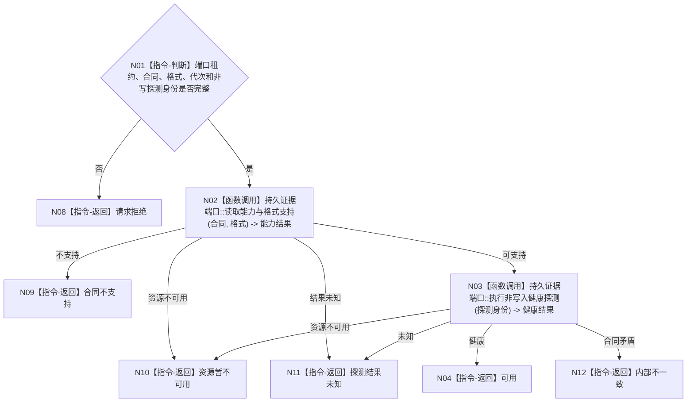

# BIZ-L4-001-04-03-01 探测持久证据端口目标函数流程图 v0.1

更新时间：2026-08-03

## 依据

```text
0050、4040、4070、8120；BIZ-L3-001-04-03
```

## 身份与边界

正式目标函数设计图。只检查配置所选持久证据端口能否接受目标格式和受控探测；不写业务事实、不创建测试业务记录，也不把端口可用解释为恢复或发布成功。

## 函数合同

```text
根函数：探测持久证据端口
归属模块 / 文件 / 层级：持久证据工作者协议 / 海中鱼巣/线程/协议.持久证据工作者.ixx / L4
现有或待新增：待新增；适配现有节点直接持久端口的能力与格式探测
完整签名：持久证据端口探测结果 探测持久证据端口(const 持久证据端口探测请求& 请求) noexcept
参数：请求为只读借用；含端口引用租约、端口合同身份与版本、证据格式版本、目标运行代次和非写入探测身份；引用租约覆盖调用
返回结果：不可变值式结果；含可用、配置关闭、请求拒绝、合同不支持、资源暂不可用、探测结果未知或内部不一致，以及能力版本和诊断材料；不返回业务事实
被调函数流程图：具体SQL或文件适配器探测属于适配实现，不在目标业务图重复
父图：BIZ-L3-001-04-03
```

## 流程图



## 节点合同

| 节点 | 类型 | 参数 / 输入绑定 | 结果 / 输出绑定 | 事实读写 | 后继条件 | 验证 |
| --- | --- | --- | --- | --- | --- | --- |
| N02 | 函数调用 | 合同和格式 | 能力结果 | 只读适配器能力 | 支持/不支持 | 未知版本 |
| N03 | 函数调用 | 非写探测身份 | 健康结果 | 不写业务或证据记录 | 健康/不可用/未知 | SQL不可用、文件只读 |
| 返回节点 | 指令-返回 | 能力与健康结果 | 结构化探测结论 | 无 | 精确分类 | 可用不等于恢复成功 |

## 关键边界

探测不得调用“准备证据”后再删除测试行；删除持久材料也不能证明无业务副作用。资源不可用只令可选工作者降级，不改变内存权威、业务线程启动或退出码。
