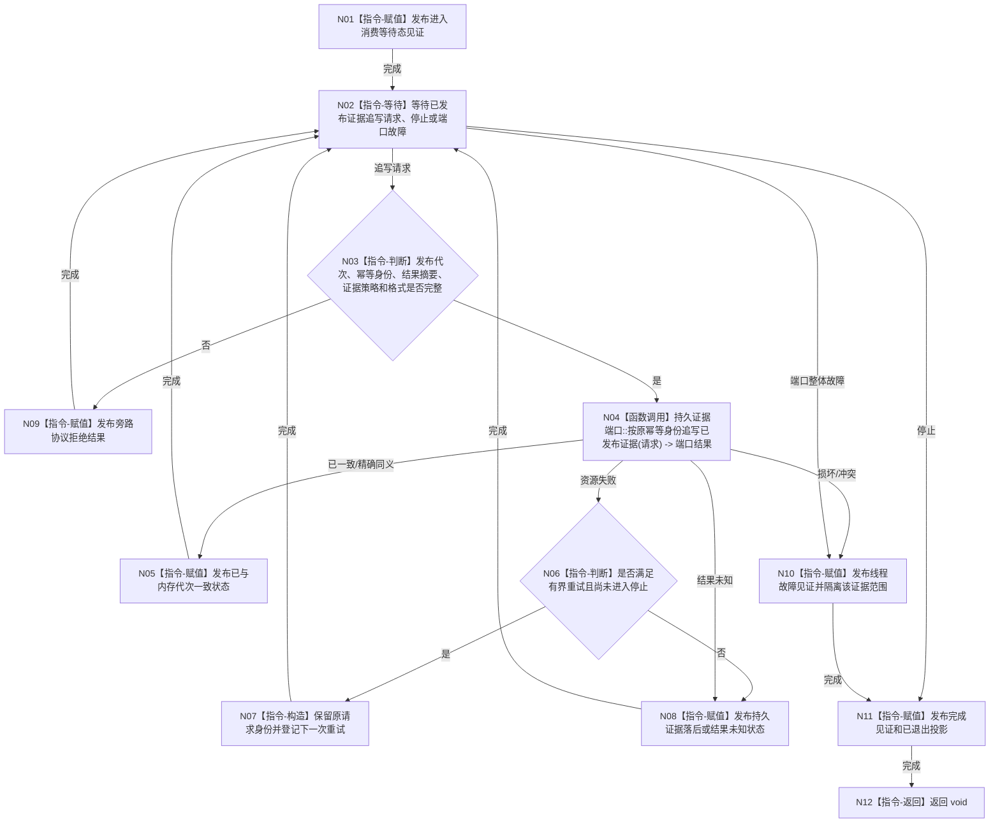

# BIZ-L4-001-04-03-02 运行持久证据工作者入口目标函数流程图 v0.1

更新时间：2026-08-03

## 依据

```text
0050、4040、4070、8110；BIZ-L3-001-04-03
旧鱼巣旁路只吸收“持久材料与显示和业务裁决分离”节奏
```

## 身份与边界

正式目标函数设计图。可选工作者只消费已经发布的事实证据追写请求，保存持久证据状态并上报旁路结果；凡是业务合同要求发布前持久准备的写入，必须留在4040同步事务参与者中，不能转交本工作者。

## 函数合同

```text
根函数：持久证据工作者::运行线程入口
归属模块 / 文件 / 层级：持久证据工作者 / 海中鱼巣/线程/持久证据工作者.ixx / L4
现有或待新增：待新增
完整签名：void 持久证据工作者::运行线程入口(持久证据工作者入口材料 入口材料) noexcept
参数：入口材料按值由线程独占；含运行代次、逻辑身份、已发布证据有界队列借用租约、持久证据端口、允许格式组、重试策略、停止令牌、进入/完成见证和生命周期端口；全部借用覆盖线程租约
返回结果：void；逐项持久状态、降级和故障通过专用旁路结果及线程见证上报，不改原业务结果
被调函数流程图：具体端口写入遵守4040/4070适配合同；共享生命周期见BIZ-L4-001-04-00-01—03
父图：BIZ-L3-001-04-03
```

## 流程图



## 节点合同

| 节点 | 类型 | 参数 / 输入绑定 | 结果 / 输出绑定 | 事实读写 | 后继条件 | 验证 |
| --- | --- | --- | --- | --- | --- | --- |
| N03 | 指令-判断 | 已发布证据请求 | 追写资格 | 无 | 完整发布见证 | 未发布候选禁止入队 |
| N04 | 函数调用 | 原幂等身份和发布代次 | 具名持久状态 | 只写SQL/文件证据 | 一致/失败/未知 | SQL成功不等于业务发布 |
| N06/N07 | 指令 | 重试策略和原请求 | 有界重试材料 | 队列私有状态 | 同身份重试 | 禁止生成第二身份 |
| N08/N10 | 指令 | 失败或冲突 | 落后/未知/隔离状态 | 不改内存权威 | 继续或故障收束 | 失败不回滚业务事实 |

## 关键边界

工作者不能消费恢复候选并直接发布运行期事实；恢复必须由4070隔离、全量互证、重新准入和4040原子发布。停止时未追写材料的刷新或接管由 BIZ-L2-001-15 冻结，本入口不得静默丢弃。

