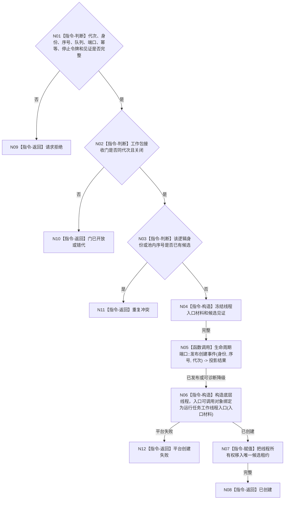

# BIZ-L4-001-05-01-01 创建任务工作线程候选目标函数流程图 v0.1

更新时间：2026-08-03

## 依据

```text
8100、8110、8120；BIZ-L3-001-05-01
当前任务工作线程::启动可复用平台线程壳，但当前代码只yield且缺运行代次、池内序号、关闭接收门和移动租约
```

## 身份与边界

正式目标函数设计图。创建一个绑定池内稳定序号、运行代次和关闭工作包接收门的候选；新线程只能进入等待态，启动阶段不得取出工作包。

## 函数合同

```text
根函数：任务工作线程::创建启动候选
归属模块 / 文件 / 层级：任务工作线程 / 海中鱼巣/线程/任务工作线程.ixx / L4
现有或待新增：适配扩展；复用std::thread创建，补齐强类型入口材料和唯一移动租约
完整签名：任务工作线程候选创建结果 任务工作线程::创建启动候选(const 任务工作线程候选创建请求& 请求)
参数：请求为只读借用；含运行代次、逻辑身份、池内稳定序号、关闭的工作包接收门身份、工作包/回执队列借用租约、筹办/执行端口、启动幂等身份、停止令牌和见证组；借用覆盖线程租约
返回结果：移动值式结果；含已创建、请求拒绝、门已开放、重复冲突、平台创建失败或内部不一致，以及唯一任务工作线程候选租约
被调函数流程图：BIZ-L4-001-05-01-02 运行任务工作线程入口；8110生命周期投影为共享旁路
父图：BIZ-L3-001-05-01
```

## 流程图



## 节点合同

| 节点 | 类型 | 参数 / 输入绑定 | 结果 / 输出绑定 | 事实读写 | 后继条件 | 验证 |
| --- | --- | --- | --- | --- | --- | --- |
| N02/N03 | 指令-判断 | 接收门、身份和序号 | 候选资格 | 只读线程本地状态 | 关闭门且唯一 | 开门抢跑、重复序号 |
| N05 | 函数调用 | 线程生命周期材料 | 投影结果 | 只写8110旁路 | 可降级 | 投影失败不阻断创建 |
| N06/N07 | 指令 | 独占入口材料 | 移动租约 | 只改线程资源 | 平台创建成功 | 禁止detach |

## 关键边界

工作包队列中即使已有材料，接收门开放前也不得出队。候选租约不证明线程池完整，只有全部池内位置进入后才能由L2父函数发布完整池租约。
