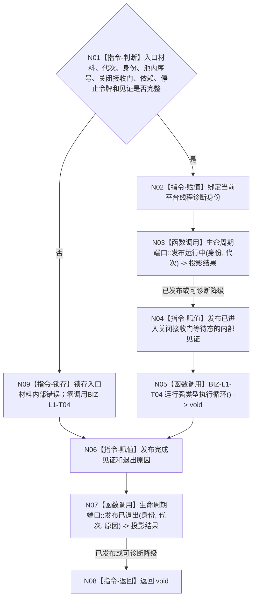

# BIZ-L4-001-05-01-02 运行任务工作线程入口目标函数流程图 v0.1

更新时间：2026-08-27

## 依据

```text
8100、8110、8120、8200；BIZ-L1-T04 v0.4、BIZ-L3-001-05-01
BIZ-L2-004-07与004-15只由BIZ-L1-T04根循环直接调用；平台入口不得复制工作包或故障裁决
```

## 身份与边界

正式目标函数设计图。本函数只把一个已冻结线程候选接入BIZ-L1-T04根循环：复核入口材料、绑定平台线程诊断身份、发布内部进入见证、调用唯一工作包循环，并在其返回后发布完成见证。等待、取包、恢复、工作结果定位和线程故障分账均属于BIZ-L1-T04，不在本入口复制。

## 函数合同

```text
根函数：任务工作线程::运行线程入口
归属模块 / 文件 / 目标分解深度：任务工作线程 / 海中鱼巣/线程/任务工作线程.ixx / BIZ-L4
现有或待新增：目标入口未实现；HEAD私有`运行结果尾部()`是已形成结果的旧尾部循环，输入、职责、失败保留和调用边均与本目标不同
完整签名：void 任务工作线程::运行线程入口(任务工作线程入口材料 入口材料) noexcept
参数：入口材料按值由线程独占；含运行代次、逻辑身份、池内序号、关闭的工作包接收门、不可变工作包来源、工作结果定位交付端、BIZ-L1-T04所需provider、停止令牌和进入/完成见证；全部借用覆盖线程租约
返回结果：void；物理返回只证明平台入口结束，不证明任何工作包、任务或需求结论
被调函数流程图：BIZ-L1-T04 `任务工作线程::运行强类型执行循环()`；BIZ-L2-004-07与004-15只在该根循环内部展开
父图：BIZ-L3-001-05-01
```

## 流程图



## 节点合同

| 节点 | 类型 | 参数 / 输入绑定 | 结果 / 输出绑定 | 事实读写 | 后继条件 | 验证 |
| --- | --- | --- | --- | --- | --- | --- |
| N01/N09 | 指令 | 完整入口材料 | 准入或入口内部错误 | 只改线程本地见证 | 完整才进入根循环 | 空依赖、错代、重复序号、坏见证零取包 |
| N02/N03 | 指令/函数调用 | 线程身份与代次 | 诊断绑定和8110投影结果 | 只改线程本地状态和旁路投影 | 投影可降级 | 系统线程ID只作诊断 |
| N04 | 指令 | 关闭接收门和候选身份 | 内部进入见证 | 不读取工作包 | 见证发布后父级才可计入池 | 零任务、队列已有项仍零消费 |
| N05 | 函数调用 | 已冻结的根循环依赖 | void | 事实读写、恢复和结果定位全部由BIZ-L1-T04及其子函数分账 | 根循环返回 | 入口零复制004-07/004-15 |
| N06—N08 | 指令/函数调用 | 根循环或入口失败结果 | 完成见证、退出投影和物理返回 | 不生成任务完成 | 始终收束 | 投影失败不覆盖内部完成见证 |

## 关键边界

本入口的内部进入见证只证明物理线程已经能够进入BIZ-L1-T04且接收门仍关闭，不证明T03已启动、门已开放或任何工作已消费。8110投影只作旁路，不能替代进入/完成见证。工作包、动作后不可逆材料、定位重交和故障投影全部留在BIZ-L1-T04；平台入口不得建立第二队列、第二恢复槽或第二业务循环。

## 冻结发布源码对照（提交 `95b4df74`）

- `运行结果尾部()`只等待本地`deque<任务工作结果材料>`；取出后调用`形成任务结果回执`，成功才调用T03 `提交任务结果回执`。它不读取关闭接收门，不消费筹办/执行工作包，也不调用BIZ-L2-004-07或004-15。
- 回执形成失败、T03上交拒绝或资源等待都只增加拒绝计数；已取材料不会进入同回执重试、停机接管或结构化恢复槽。这与动作后不可重做和结果定位必须守恒的目标合同不等价。
- 当前等待、锁外形成/上交和最终`join`可作为并发机械参考；旧尾部循环本身必须退出目标主路，不能改名冒充本入口。
