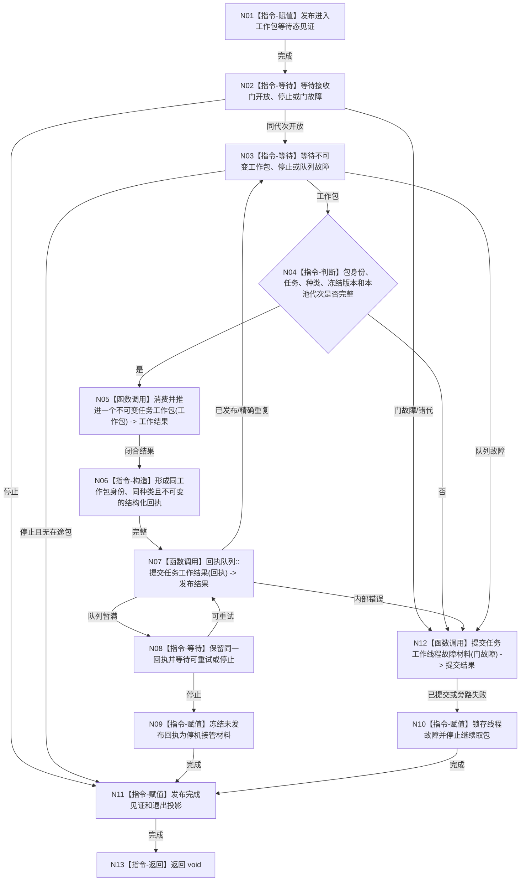

# BIZ-L4-001-05-01-02 运行任务工作线程入口目标函数流程图 v0.1

更新时间：2026-08-03

## 依据

```text
8100、8110、8200；BIZ-L1-T04、BIZ-L2-004-07、BIZ-L2-004-15、BIZ-L3-001-05-01
旧鱼巣只吸收“执行前复核—动作—实际结果—回执”顺序，不迁移线程内业务裁决或旧函数指针分派
```

## 身份与边界

正式目标函数设计图。工作线程不选择筹办或执行；它等待任务管理开放接收门并取得一个不可变工作包，再调用包内已冻结种类对应的正式处理入口，最后上报同种类结构化回执。

## 函数合同

```text
根函数：任务工作线程::运行线程入口
归属模块 / 文件 / 层级：任务工作线程 / 海中鱼巣/线程/任务工作线程.ixx / L4
现有或待新增：目标替换；复用强类型回执协议和调度入口，退出旧运行消息兼容消费主路
完整签名：void 任务工作线程::运行线程入口(任务工作线程入口材料 入口材料) noexcept
参数：入口材料按值由线程独占；含运行代次、逻辑身份、池内序号、工作包接收门、不可变工作包队列、回执队列、筹办/执行处理端口、停止令牌和见证组；借用覆盖线程租约
返回结果：void；每个工作包产生一个同身份结构化回执或可接管故障材料；线程不直接返回业务结论
被调函数流程图：BIZ-L2-004-07 消费并推进一个不可变任务工作包；BIZ-L2-004-15 提交任务工作线程故障材料
父图：BIZ-L3-001-05-01
```

## 流程图



## 节点合同

| 节点 | 类型 | 参数 / 输入绑定 | 结果 / 输出绑定 | 事实读写 | 后继条件 | 验证 |
| --- | --- | --- | --- | --- | --- | --- |
| N02/N03 | 指令-等待 | 接收门、工作包队列、停止令牌 | 开放/包/停止 | 只改线程等待投影 | 门开放后出队 | 启动阶段零消费、伪唤醒 |
| N04/N05 | 指令/函数调用 | 不可变工作包 | 闭合工作结果 | 领域服务按各自写权；线程不裸写 | 包种类已冻结 | 筹办/执行不由线程重判 |
| N06—N09 | 指令/函数调用 | 工作结果 | 同身份回执或接管材料 | 只写线程队列材料 | 已发布/重试/接管 | 回执失败不得重做动作 |
| N12/N10 | 函数调用/指令 | 线程故障 | 故障材料和停止 | 不伪造任务失败 | 停止取包 | 故障旁路失败仍保留本地见证 |

## 关键边界

线程停机不等于任务完成或失败。工作包一旦执行了有副作用动作，回执发布失败只能重发同一回执或交给停机接管，绝不能重做动作。旧鱼巣的筹办/执行顺序被保留在BIZ-L2-004-07，未被复制到线程调度器。
