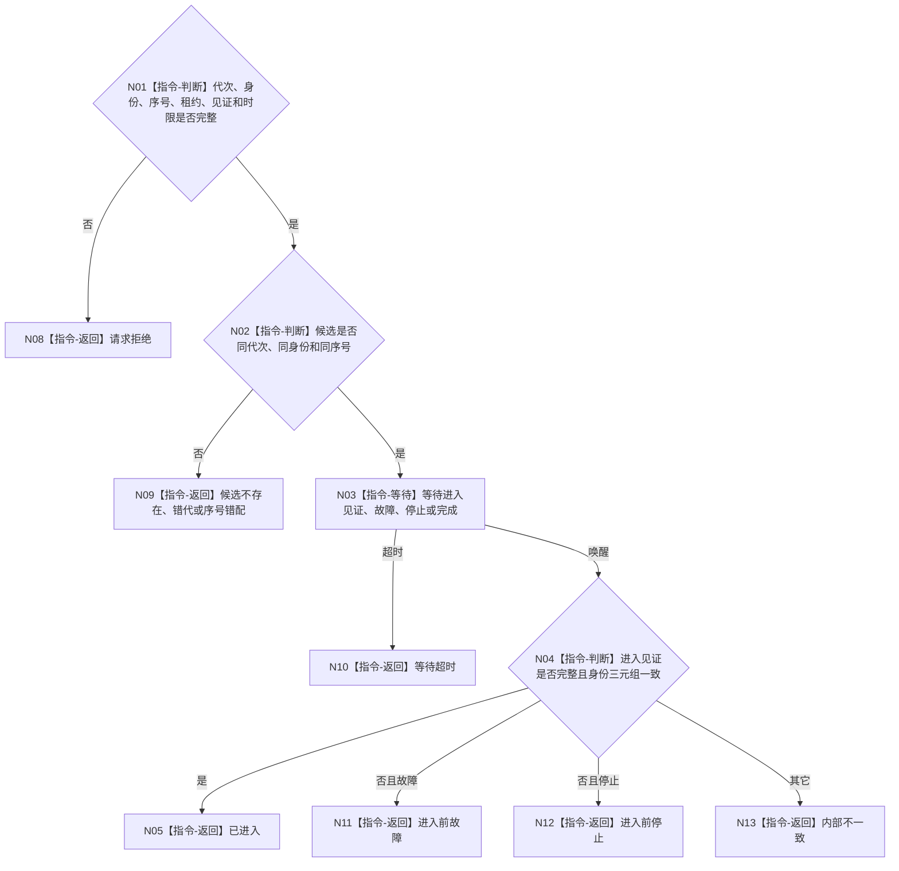

# BIZ-L4-001-05-01-03 等待任务工作线程进入见证目标函数流程图 v0.1

更新时间：2026-08-03

## 依据

```text
8110、8120；BIZ-L3-001-05-01
```

## 身份与边界

正式目标函数设计图。等待指定池内线程进入关闭接收门后的工作包等待态；不得等待或消费第一个工作包来证明线程已进入。

## 函数合同

```text
根函数：任务工作线程::等待进入见证
归属模块 / 文件 / 层级：任务工作线程 / 海中鱼巣/线程/任务工作线程.ixx / L4
现有或待新增：待新增
完整签名：任务工作线程进入等待结果 任务工作线程::等待进入见证(const 任务工作线程进入等待请求& 请求) const
参数：请求为只读借用；含运行代次、逻辑身份、池内序号、候选租约身份、进入见证身份和非零单调最长等待
返回结果：不可变值式结果；含已进入、请求拒绝、候选不存在、错代、序号错配、进入前故障、进入前停止、等待超时或内部不一致，以及进入见证
被调函数流程图：无；条件等待和见证复核为本函数内指令
父图：BIZ-L3-001-05-01
```

## 流程图



## 节点合同

| 节点 | 类型 | 参数 / 输入绑定 | 结果 / 输出绑定 | 事实读写 | 后继条件 | 验证 |
| --- | --- | --- | --- | --- | --- | --- |
| N02 | 指令-判断 | 候选租约和池内身份 | 候选一致性 | 无 | 三元组一致 | 错代和重复序号 |
| N03 | 指令-等待 | 单调时限 | 唤醒原因 | 无 | 进入/终止/超时 | 墙钟跳变、伪唤醒 |
| N04 | 指令-判断 | 进入见证 | 结构化结果 | 只读见证 | 完整一致 | 零业务消费仍可进入 |

## 关键边界

进入结果不证明任务管理线程已经启动、接收门已经开放或线程池已经对外发布；这些由父级顺序和完整池租约分别裁决。

