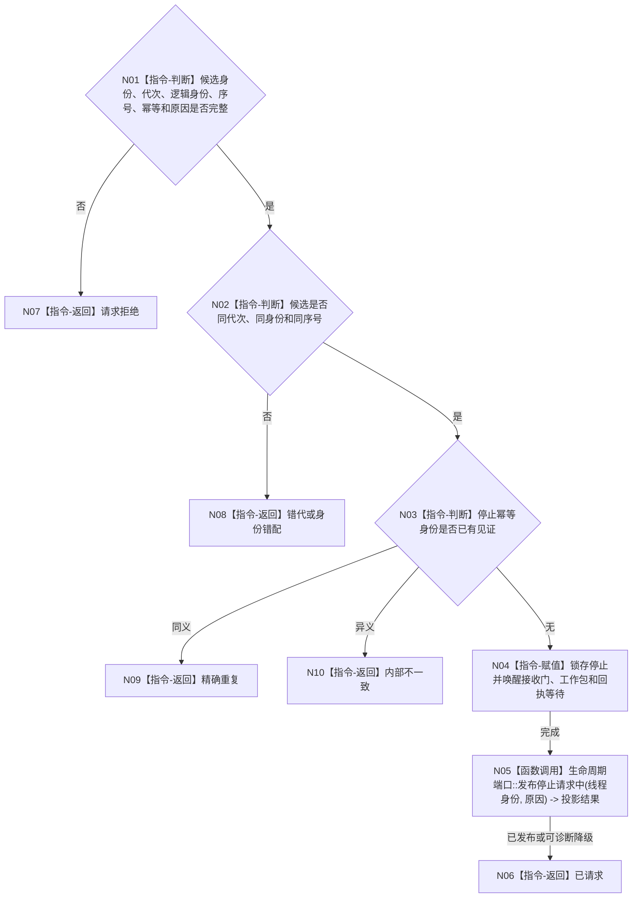

# BIZ-L4-001-05-02-01 请求一个任务工作线程启动候选停止目标函数流程图 v0.1

更新时间：2026-08-03

## 依据

```text
8100、8110、8120；BIZ-L3-001-05-02
```

## 身份与边界

正式目标函数设计图。为线程池启动半失败场景锁存一个尚未对外发布候选的停止请求并唤醒其所有等待；只发请求，不连接、不丢弃队列，也不生成任务结果。

## 函数合同

```text
根函数：请求一个任务工作线程启动候选停止
归属模块 / 文件 / 层级：线程启动协调 / 海中鱼巣/启动.线程组协调.ixx / L4
现有或待新增：待新增；复用当前停止锁存与条件唤醒
完整签名：任务工作线程候选停止结果 请求一个任务工作线程启动候选停止(const 任务工作线程候选停止请求& 请求) noexcept
参数：请求为只读借用；含候选租约身份、运行代次、逻辑身份、池内序号、停止幂等身份和启动回收原因；调用方继续持有租约
返回结果：不可变值式结果；含已请求、精确重复、请求拒绝、错代、身份错配或内部不一致，以及停止见证
被调函数流程图：无；锁存、唤醒和8110旁路发布为本函数内协调指令
父图：BIZ-L3-001-05-02
```

## 流程图



## 节点合同

| 节点 | 类型 | 参数 / 输入绑定 | 结果 / 输出绑定 | 事实读写 | 后继条件 | 验证 |
| --- | --- | --- | --- | --- | --- | --- |
| N02/N03 | 指令-判断 | 候选与幂等身份 | 停止资格 | 只读线程状态 | 同候选 | 重复和异义停止 |
| N04 | 指令-赋值 | 停止请求 | 停止见证 | 只改线程运行状态 | 原子锁存 | 多等待点全部唤醒 |
| N05 | 函数调用 | 线程投影材料 | 投影结果 | 只写8110旁路 | 可降级 | 投影失败不撤回停止 |

## 关键边界

如果候选已取得并处理工作包，本函数必须返回身份阶段不匹配，调用方转入正式停机链；不得以“启动回收”丢弃在途工作或回执。
