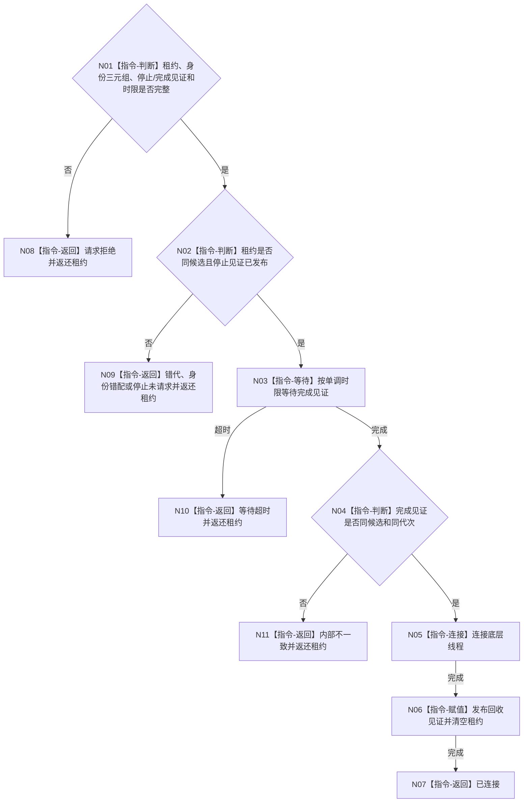

# BIZ-L4-001-05-02-02 连接一个任务工作线程启动候选目标函数流程图 v0.1

更新时间：2026-08-03

## 依据

```text
8100、8110、8120；BIZ-L3-001-05-02
```

## 身份与边界

正式目标函数设计图。只在指定启动候选已发布完成见证后连接底层线程并清空唯一租约；不负责首次发停止，也不处理已对外发布线程池的正式停机。

## 函数合同

```text
根函数：连接一个任务工作线程启动候选
归属模块 / 文件 / 层级：线程启动协调 / 海中鱼巣/启动.线程组协调.ixx / L4
现有或待新增：待新增；复用join并补齐单调时限与租约返还
完整签名：任务工作线程候选连接结果 连接一个任务工作线程启动候选(任务工作线程候选租约&& 候选租约, const 任务工作线程候选连接请求& 请求) noexcept
参数：候选租约为唯一移动所有权；请求为只读借用，含代次、逻辑身份、池内序号、停止见证、完成见证和非零单调最长等待
返回结果：移动值式结果；含已连接、请求拒绝、错代、身份错配、停止未请求、等待超时或内部不一致；未连接时返还唯一租约
被调函数流程图：无；等待完成、join和回收见证为本函数内指令
父图：BIZ-L3-001-05-02
```

## 流程图



## 节点合同

| 节点 | 类型 | 参数 / 输入绑定 | 结果 / 输出绑定 | 事实读写 | 后继条件 | 验证 |
| --- | --- | --- | --- | --- | --- | --- |
| N02 | 指令-判断 | 租约和停止见证 | 连接资格 | 只读线程状态 | 已请求停止 | 无停止直接join拒绝 |
| N03/N04 | 指令 | 完成见证和时限 | 完成/超时 | 无 | 同候选完成 | 伪唤醒、错代见证 |
| N05/N06 | 指令 | 已完成租约 | 连接和回收见证 | 释放线程资源 | 只连接一次 | 双join、detach、租约丢失 |

## 关键边界

先对全部已启动候选发停止，再逐个连接，避免按序join阻止后续线程收到停止。超时结果必须返还租约；调用方不得清理或覆盖仍拥有线程的对象。

