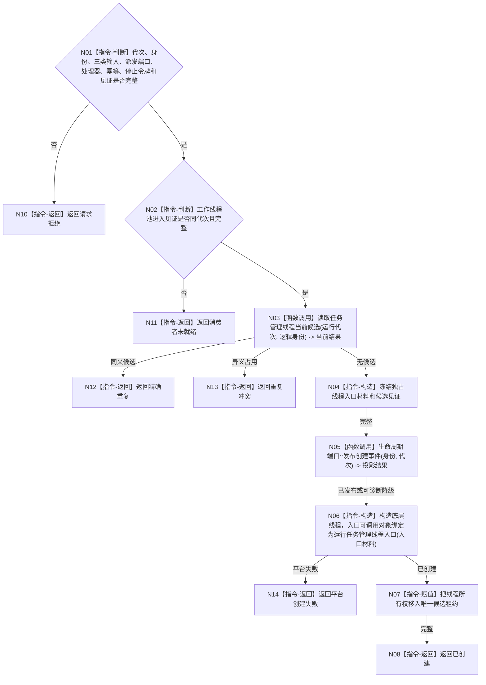

# BIZ-L4-001-06-01-01 创建任务管理线程候选目标函数流程图 v0.1

更新时间：2026-08-03

## 依据

```text
8100、8110、8120；BIZ-L3-001-06-01；当前任务管理线程::启动
```

## 身份与边界

正式目标函数设计图。创建唯一任务管理线程候选并冻结三类输入源、工作包派发端口和领域处理器组；候选只可进入等待态，不因线程创建而生成或推进任务。

## 函数合同

```text
根函数：任务管理线程::创建启动候选
归属模块 / 文件 / 层级：任务管理线程 / 海中鱼巣/线程/任务管理线程.ixx / L4
现有或待新增：适配扩展；复用std::thread和现有队列壳，补齐运行代次、强类型入口材料、幂等身份和唯一移动租约
完整签名：任务管理线程候选创建结果 任务管理线程::创建启动候选(const 任务管理线程候选创建请求& 请求)
参数：请求为只读借用；含运行代次、唯一逻辑身份、自我治理输入队列、外设报告消费端口、任务工作结果队列、工作包派发端口、领域处理器组、同代次工作线程池进入见证、启动幂等身份、停止令牌和线程见证组；全部借用覆盖候选租约
返回结果：移动值式结果；含已创建、请求拒绝、消费者未就绪、精确重复、重复冲突、平台创建失败或内部不一致，以及唯一任务管理线程候选租约
被调函数流程图：BIZ-L4-001-06-01-02 运行任务管理线程入口；8110生命周期投影为诊断旁路
父图：BIZ-L3-001-06-01
```

## 流程图



## 节点合同

| 节点 | 类型 | 参数 / 输入绑定 | 结果 / 输出绑定 | 事实读写 | 后继条件 | 验证 |
| --- | --- | --- | --- | --- | --- | --- |
| N02/N03 | 指令 / 函数调用 | 池见证、代次和身份 | 候选资格 | 只读线程投影 | 消费者已进入且候选唯一 | 错代、重复和异义启动 |
| N05 | 函数调用 | 线程生命周期材料 | 投影结果 | 只写8110旁路 | 允许诊断降级 | 投影失败不伪造业务失败 |
| N06/N07 | 指令 | 独占入口材料 | 唯一移动租约 | 只改线程资源 | 平台创建成功 | 禁止detach和复制租约 |

## 关键边界

三类输入源只是运行期借用，不转移其业务事实所有权。工作线程池见证只证明消费者可等待；任务管理候选尚未对外发布前不得被其它线程当作任务已可派发的事实。
