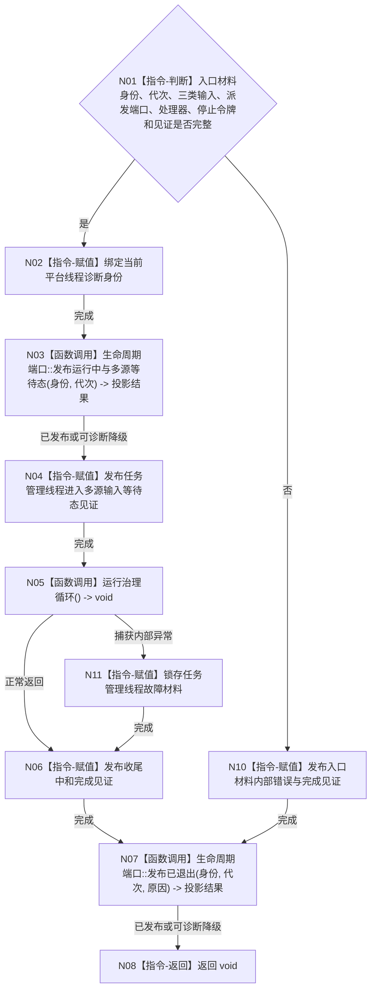

# BIZ-L4-001-06-01-02 运行任务管理线程入口目标函数流程图 v0.1

更新时间：2026-08-03

## 依据

```text
8100、8110、8200；BIZ-L1-T03、BIZ-L2-004-09、BIZ-L3-001-06-01
旧鱼巣只吸收任务承接—派发—回执—重判节奏，不迁移线程内裸写需求、任务或世界事实
```

## 身份与边界

正式目标函数设计图。线程平台入口先发布多源输入等待态见证，再调用唯一任务治理循环；治理循环结束后发布完成见证。入口本身不裁决任务阶段、不执行筹办或真实方法动作。

## 函数合同

```text
根函数：任务管理线程::运行线程入口
归属模块 / 文件 / 层级：任务管理线程 / 海中鱼巣/线程/任务管理线程.ixx / L4
现有或待新增：目标替换；替换当前只yield的线程lambda，复用BIZ-L1-T03治理循环
完整签名：void 任务管理线程::运行线程入口(任务管理线程入口材料 入口材料) noexcept
参数：入口材料按值由线程独占；含运行代次、唯一逻辑身份、三类输入源、工作包派发端口、领域处理器组、工作线程池见证、停止令牌、进入/完成见证和生命周期端口；借用覆盖线程租约
返回结果：void；业务结果通过正式任务工作回执和自我治理消息表达，线程故障通过具名故障材料与生命周期旁路表达
被调函数流程图：BIZ-L1-T03 任务管理线程::运行治理循环；BIZ-L2-004-15 提交任务工作线程故障材料仅供工作线程，任务管理线程故障使用8110具名生命周期故障材料
父图：BIZ-L3-001-06-01
```

## 流程图



## 节点合同

| 节点 | 类型 | 参数 / 输入绑定 | 结果 / 输出绑定 | 事实读写 | 后继条件 | 验证 |
| --- | --- | --- | --- | --- | --- | --- |
| N01/N02 | 指令 | 独占入口材料 | 有效平台绑定 | 只改线程本地状态 | 材料完整 | 空端口、错代和身份缺失 |
| N03/N04 | 函数调用 / 指令 | 生命周期材料 | 进入见证 | 8110旁路和线程见证 | 不依赖业务输入到达 | 零任务仍可进入 |
| N05 | 函数调用 | 对象已冻结依赖 | void | 业务写入只经BIZ-L1-T03所调领域服务 | 治理循环返回 | 不在入口复制阶段裁决 |
| N06/N07 | 指令 / 函数调用 | 完成原因 | 完成见证与退出投影 | 不生成任务完成 | 始终执行 | 投影失败不阻断资源回收 |

## 关键边界

进入见证证明线程已能等待三类输入，不证明已有任务、任务可执行或任何任务状态已经推进。线程生命周期消息不进入自我治理邮箱，也不能作为任务结果。

