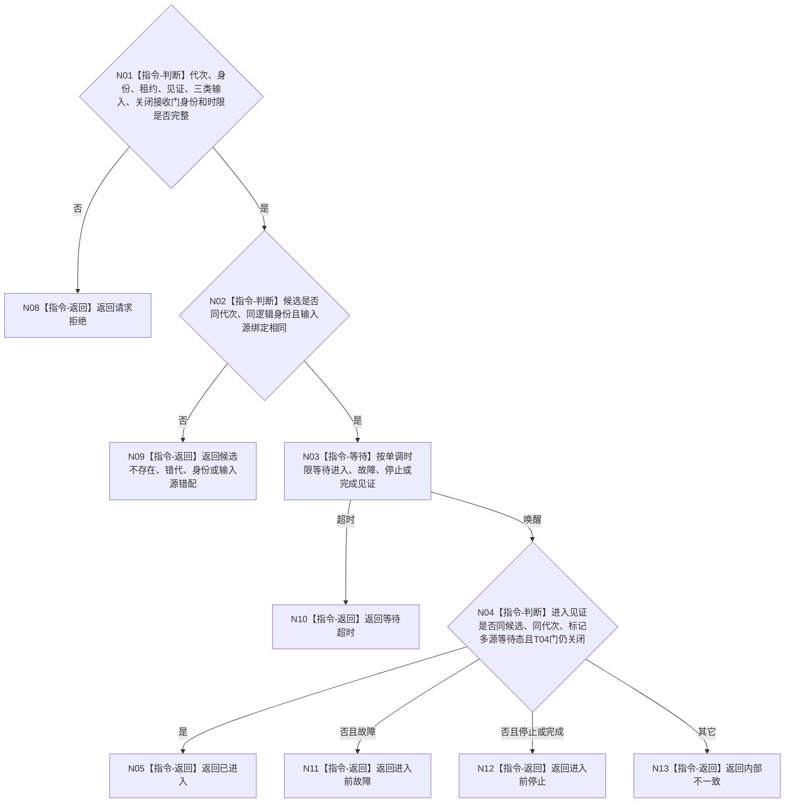

# BIZ-L4-001-06-01-03 等待任务管理线程进入多源输入等待态目标函数流程图 v0.1

更新时间：2026-08-27

## 依据

```text
8110、8120；BIZ-L3-001-06-01
```

## 身份与边界

正式目标函数设计图。等待唯一任务管理线程候选发布同代次多源输入等待态见证，并证明它仍停在T04关闭接收门联锁上；不以第一条输入到达、第一份工作包派发或控制面板显示作为进入证明。

## 函数合同

```text
根函数：任务管理线程::等待进入多源输入等待态
归属模块 / 文件 / 目标分解深度：任务管理线程 / 海中鱼巣/线程/任务管理线程.ixx / BIZ-L4
现有或待新增：未实现；替代HEAD无身份`线程已进入()`原子量读取
完整签名：任务管理线程进入等待结果 任务管理线程::等待进入多源输入等待态(const 任务管理线程进入等待请求& 请求) const
参数：请求为只读借用；含运行代次、唯一逻辑身份、候选租约身份、进入见证身份、三类输入源身份、同代次T04关闭接收门身份和非零单调最长等待
返回结果：不可变值式结果；含已进入、请求拒绝、候选不存在、错代、身份错配、输入源错配、进入前故障、进入前停止、等待超时或内部不一致，以及进入见证
被调函数流程图：无；条件等待和见证复核均为本函数内指令
父图：BIZ-L3-001-06-01
```

## 流程图



## 节点合同

| 节点 | 类型 | 参数 / 输入绑定 | 结果 / 输出绑定 | 事实读写 | 后继条件 | 验证 |
| --- | --- | --- | --- | --- | --- | --- |
| N02 | 指令-判断 | 候选、代次、身份和输入绑定 | 候选一致性 | 无 | 全部一致 | 借用替换与错代 |
| N03 | 指令-等待 | 单调时限和见证组 | 唤醒原因 | 无 | 进入、故障、停止或超时 | 墙钟跳变和伪唤醒 |
| N04 | 指令-判断 | 进入见证 | 结构化结果 | 只读见证 | 多源等待态完整 | 第一条消息不得替代见证 |

## 关键边界

工作线程池见证属于启动前置，任务管理线程进入见证属于本线程后置；两者不能互相替代。成功结果必须发生在T04门仍关闭时，父级随后才可开放门。控制面板线程投影迟到或不可用不改变进入结果。

## 当前代码对应（已发布基线 `d5e6373e`）

- HEAD没有本函数、进入等待请求/结果、候选租约身份、多源输入绑定或单调时限。
- 相邻`线程已进入()`只读取无身份`std::atomic<bool> 已进入`；`启动()`不调用它，也没有条件等待，因此平台线程构造成功就向调用方返回。
- lambda置真`已进入`后立即调用旧治理循环，既不证明三类输入等待态，也不证明T04仍关闭，不能作为本目标进入见证。
