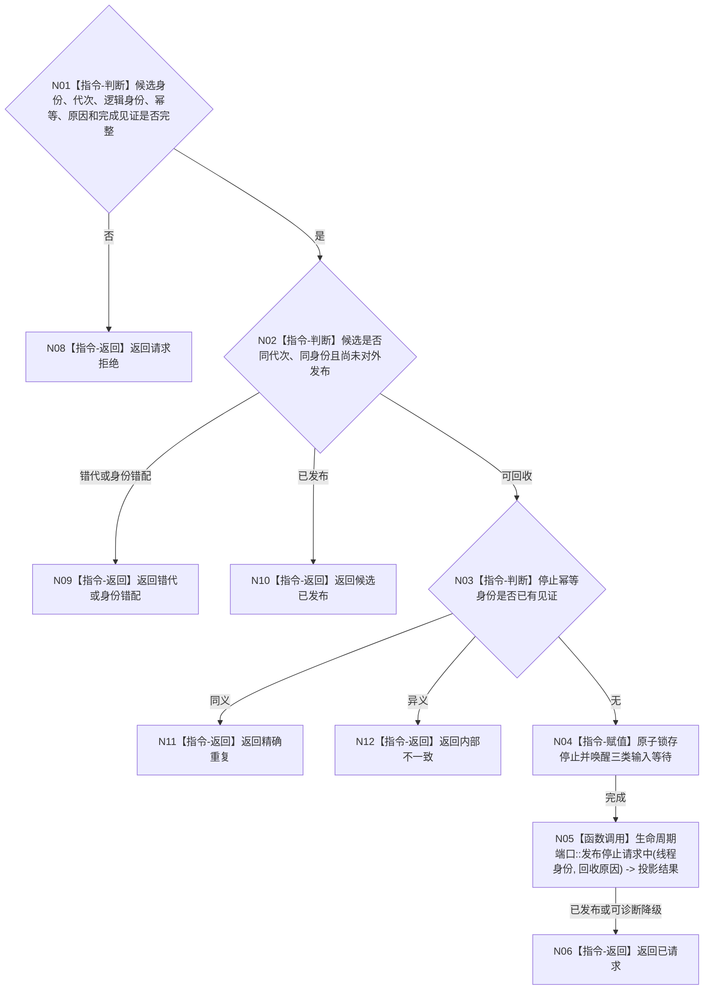

# BIZ-L4-001-06-02-01 请求任务管理线程启动候选停止目标函数流程图 v0.1

更新时间：2026-08-03

## 依据

```text
8100、8110、8120；BIZ-L3-001-06-02；当前任务管理线程::请求停止并发送停止消息
```

## 身份与边界

正式目标函数设计图。只为尚未对外发布的任务管理线程启动候选锁存停止并唤醒全部输入等待；不连接线程、不清理队列，也不生成任务取消、失败或完成结果。

## 函数合同

```text
根函数：请求任务管理线程启动候选停止
归属模块 / 文件 / 层级：线程启动协调 / 海中鱼巣/启动.线程组协调.ixx / L4
现有或待新增：待新增；复用当前停止原子量和停止消息能力，补齐候选身份、运行代次和幂等见证
完整签名：任务管理线程候选停止结果 请求任务管理线程启动候选停止(const 任务管理线程候选停止请求& 请求) noexcept
参数：请求为只读借用；含候选租约身份、运行代次、唯一逻辑身份、停止幂等身份、启动回收原因和完成见证身份；调用方继续持有候选租约
返回结果：不可变值式结果；含已请求、精确重复、请求拒绝、错代、身份错配、候选已发布、停止发布失败或内部不一致，以及停止见证
被调函数流程图：无；锁存、唤醒和8110旁路发布为本函数内协调指令
父图：BIZ-L3-001-06-02
```

## 流程图



## 节点合同

| 节点 | 类型 | 参数 / 输入绑定 | 结果 / 输出绑定 | 事实读写 | 后继条件 | 验证 |
| --- | --- | --- | --- | --- | --- | --- |
| N02/N03 | 指令-判断 | 候选阶段和幂等身份 | 停止资格 | 只读线程状态 | 未发布且同候选 | 已发布必须转正式停机链 |
| N04 | 指令-赋值 | 停止请求 | 停止见证 | 只改线程运行状态 | 原子锁存 | 三类等待全部唤醒 |
| N05 | 函数调用 | 生命周期材料 | 投影结果 | 只写8110旁路 | 可诊断降级 | 投影失败不撤回停止 |

## 关键边界

候选一旦已经对外发布或产生在途工作，就必须进入正式停机排空链。本函数不能把未处理输入、在途工作或未上报回执静默丢弃。

