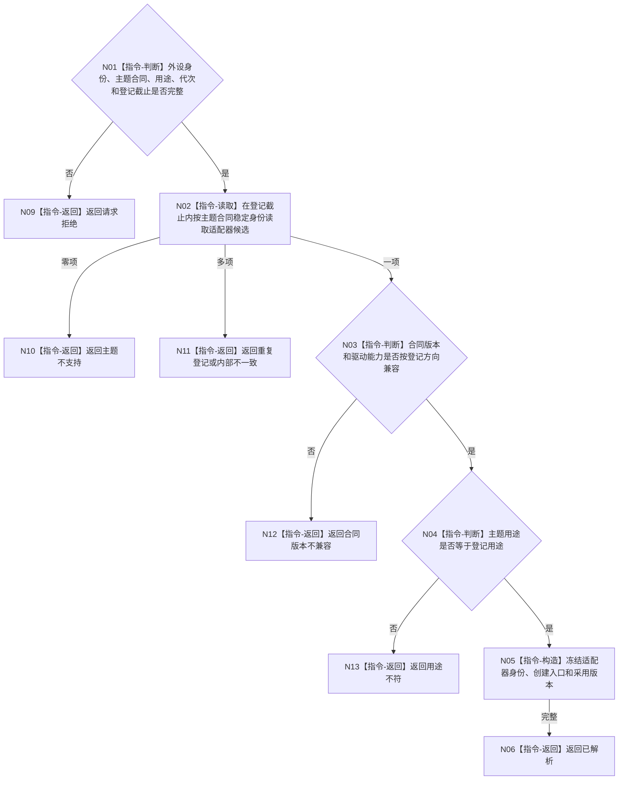

# BIZ-L4-001-07-01-01 解析已登记外设主题启动适配器目标函数流程图 v0.1

更新时间：2026-08-03

## 依据

```text
6320、6340、6350、8110；BIZ-L3-001-07-01
```

## 身份与边界

正式目标函数设计图。按外设主题合同稳定身份、版本和用途，从只读登记中解析唯一启动适配器；当前正式启用双目相机主题，其它主题未登记时必须返回不支持，不得按名称或材料形状猜测。

## 函数合同

```text
根函数：外设启动适配器注册表::解析
归属模块 / 文件 / 层级：外设线程启动协调 / 海中鱼巣/启动.外设适配器注册.ixx / L4
现有或待新增：待新增；首个正式登记为6350双目相机启动适配器
完整签名：外设启动适配器解析结果 外设启动适配器注册表::解析(const 外设启动适配器解析请求& 请求) const
参数：请求为只读借用；含外设稳定身份、主题合同稳定身份与版本、用途、运行代次、驱动能力版本和登记截止版本
返回结果：调用方拥有的不可变值式结果；含已解析、主题不支持、合同版本不兼容、用途不符、重复登记或内部不一致，以及唯一具名适配器身份和创建入口
被调函数流程图：无独立被调项目函数；登记匹配、版本方向和唯一性是本函数内确定性指令
父图：BIZ-L3-001-07-01
```

## 流程图



## 节点合同

| 节点 | 类型 | 输入 | 输出 | 事实读写 | 验证 |
| --- | --- | --- | --- | --- | --- |
| N02—N04 | 指令 | 主题合同和登记截止 | 唯一候选或具名非成功 | 只读正式登记 | 零项、多项、版本方向和用途 |
| N05/N06 | 指令 | 唯一登记项 | 不可变适配器材料 | 无 | 创建入口非空且身份稳定 |

## 关键边界

适配器解析不打开驱动、不创建线程、不验证产品报告，也不把主题登记当作外设已经可用的证明。
