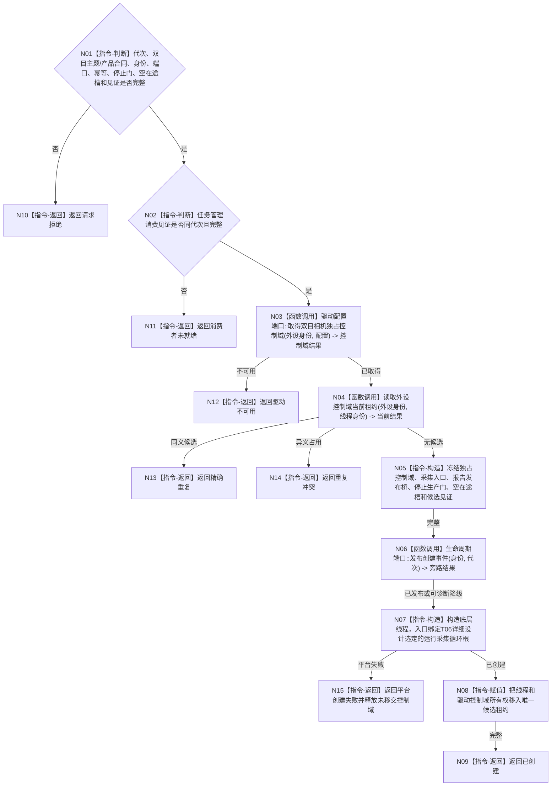

# BIZ-L4-001-07-01-02 创建双目相机外设线程候选目标函数流程图 v0.1

更新时间：2026-08-28

## 依据

```text
6320、6340、6350、8110、8120；BIZ-L3-001-07-01；BIZ-L1-T06
```

## 身份与边界

正式目标函数设计图。为一个6350双目相机外设身份创建独占驱动和采集线程候选；线程入口复用通用外设采集循环，采集、对齐、质量和报告发布由006函数链完成。

## 函数合同

```text
根函数：双目相机外设线程适配器::创建启动候选
归属模块 / 文件 / 目标分解深度：双目相机外设线程适配 / 海中鱼巣/线程/外设.双目相机线程.ixx / BIZ-L4
现有或待新增：目标类、DTO、控制域租约和线程入口未实现；可复用HEAD未接线D455采集器，但不能继承模拟线程或标量上行桥的私有直达路径
完整签名：双目相机外设线程候选创建结果 双目相机外设线程适配器::创建启动候选(const 双目相机外设线程候选创建请求& 请求)
参数：请求为只读借用；含运行代次、外设与线程逻辑稳定身份、6350主题/产品合同、驱动与配置端口、时间源、6340唯一报告发布桥、T03外设消费见证、启动幂等身份、停止生产门、唯一在途槽和8110生命周期端口；借用覆盖候选租约
返回结果：移动值式结果；含已创建、请求拒绝、消费者未就绪、驱动不可用、精确重复、重复冲突、平台创建失败或内部不一致，以及唯一双目相机线程候选租约
被调函数流程图：BIZ-L1-T06 运行采集循环（物理类、模块和签名待T06详细设计）；单次采集复用BIZ-L4-006-01-02-01，时间对齐复用BIZ-L4-006-03-02-01，质量评估复用BIZ-L4-006-03-03-01
父图：BIZ-L3-001-07-01
```

## 流程图



## 节点合同

| 节点 | 类型 | 输入 | 输出 | 事实读写 | 验证 |
| --- | --- | --- | --- | --- | --- |
| N02—N04 | 判断 / 函数调用 | 消费见证、外设和驱动配置 | 启动资格与控制域 | 只读线程投影；取得本地独占资源 | 消费者错代、驱动失败、重复 |
| N05—N08 | 指令 / 函数调用 | 入口和独占控制域 | 唯一移动候选租约 | 只写8110旁路 | 创建失败释放资源、禁止detach |

## 关键边界

线程候选不得直接向自我线程、世界树或控制面板发送报告。四类双目产品只进入一个物理报告队列，再由6340任务域独占承接。创建事件的8110投影失败允许诊断降级，但内部候选身份、独占控制域和后续进入见证不得依赖该投影补造。

## 冻结发布源码对照（提交 `79985857`）

- HEAD不存在目标`外设.双目相机线程.ixx`、候选创建请求/结果、独占控制域租约、停止生产门、唯一在途槽或绑定`运行采集循环`的线程入口。
- D455工厂可同步打开RealSense控制域并返回`unique_ptr<D455帧来源>`，采集器析构/停止可释放SDK资源；但工厂零生产调用，且没有外设/线程稳定身份、运行代次、报告桥、候选幂等或8110投影。
- 模拟外设采样材料线程明确禁止D455，不能作为本目标具体适配器；其`std::thread`创建机制只能作平台资源参考。
